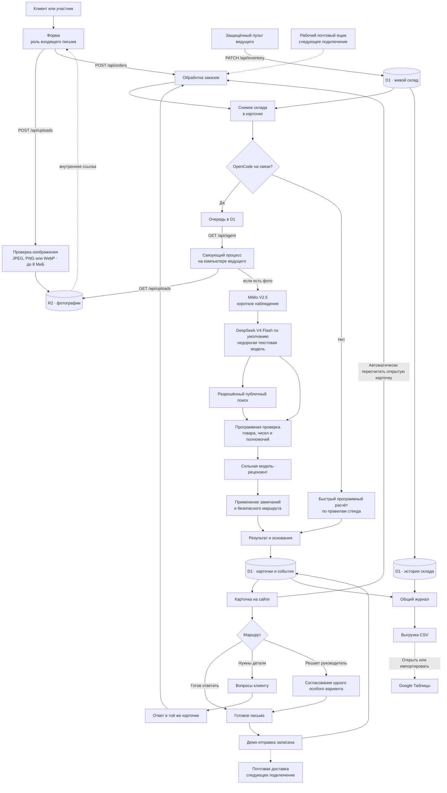
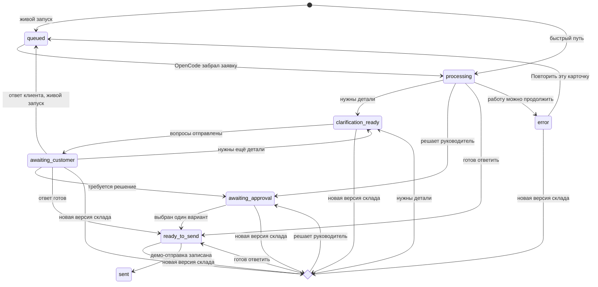

# Архитектура стенда «Колер» и сценарий вебинара

## Коротко

Стенд показывает, как агент ведёт заявку от письма до одного из трёх
результатов: готовое письмо, точные вопросы клиенту или варианты для
руководителя. По пути он читает склад, проверяет цену и сохраняет источники.

«Колер» показывает полный путь входящей заявки:

```text
письмо или фото → понимание задачи → живые факты → сведения о клиенте
→ следующий шаг → действие человека → письмо → общая история
```

Стенд отвечает на четыре вопроса зрителя:

1. Что агент делает сам?
2. На каких фактах он строит решение?
3. Где руководитель сохраняет полномочия?
4. Как изменение склада меняет следующий ответ?

Главный эффект вебинара строится вокруг живого остатка. Ведущий меняет запас
краски с 40 до 180 кг. Встроенный пульт автоматически пересчитывает открытую
карточку по новой версии склада. При живой связи OpenCode снова запускает
рабочую модель и модель-рецензента; резервный серверный расчёт сохраняет
сценарий при остановке связи. Заказ на объём выше остатка становится готовым
ответом, а история сохраняет прежнее решение и письмо.

Форма на странице играет роль входящей почты. Рабочая входящая и исходящая
почта остаются следующим подключением.

- Публичный стенд:
  [koler-agent-demo.odinmaniac.chatgpt.site](https://koler-agent-demo.odinmaniac.chatgpt.site/)
- Общая таблица:
  [данные стенда «Колер»](https://docs.google.com/spreadsheets/d/e/2PACX-1vR7jeOl2r8s8mHvuFEkhJgG9F9kRiUknVTDG_Qt7RwX3nzj8AtVJihpdhX1kxxXCULV3d5D1xhUNBmU/pubhtml)

## Что видит участник

Первый экран до формы показывает весь путь заявки:

- путь заказа от почты до общей истории;
- три маршрута в порядке зелёный → жёлтый → красный: «Готов ответить»,
  «Нужны детали», «Решает руководитель»;
- живой каталог и остатки;
- три правила продаж простыми словами;
- распределение работы между моделью, программой и руководителем;
- ссылку на общую Google-таблицу.

Правила сразу объясняют границы:

1. Всё понятно, товар есть на складе, цена приносит нужную прибыль — агент
   готовит ответ.
2. Для подбора или расчёта не хватает факта — агент спрашивает только
   недостающее.
3. Склад подтверждает часть объёма, клиент просит особую цену, оплату после
   поставки или жёсткий срок — агент приносит руководителю варианты с
   последствиями и готовым письмом.

В форме участник может:

- выбрать один из тридцати примеров;
- написать собственную заявку;
- указать компанию и сайт;
- выбрать готовый пример с уже приложенной фотографией забора;
- приложить, заменить или убрать собственное изображение;
- выбрать рабочую модель при подключённом OpenCode.

После отправки карточка показывает:

- номер и круг переписки;
- исходное письмо и вложение;
- ход действий;
- понятые факты;
- сохранённый снимок склада;
- товар, количество, цену и сумму;
- положение цены среди предложений;
- деловой контекст;
- проверяемые основания выводов;
- вопросы клиенту, варианты руководителю или готовое письмо;
- состояние отправки;
- запись в общем журнале.

## Общая схема



## Слои и среда выполнения

| Слой | Где работает | Ответственность |
|---|---|---|
| Интерфейс React и Next.js | Браузер и сайт в OpenAI Sites | Форма-письмо, карточка, маршруты, пульт, журнал и модальные источники |
| Серверные маршруты | Cloudflare Worker в публикации OpenAI Sites | Загрузка фото, создание карточек, переходы состояний, статистика, склад, журнал и служебная очередь |
| Drizzle и Cloudflare D1 | Облачная база стенда | Карточки, переписка, события, остатки, версии склада и решения руководителя |
| Cloudflare R2 | Облачное хранилище стенда | Исходные байты пользовательских фотографий по случайным внутренним ключам |
| Демонстрационный расчёт | Cloudflare Worker | Быстрый маршрут, уточнения, расчёт площади и резервный пересчёт склада |
| Связующий процесс | Node.js на компьютере ведущего | Сердцебиение, получение очереди, безопасная загрузка фото, запуск OpenCode, запись событий и результата |
| OpenCode | Компьютер ведущего | Запуск MiMo V2.5, выбранной текстовой модели, разрешённого поиска и модели-рецензента |
| Подготовленные данные | Поставка сайта | Каталог, цены, правила, сравнение цен, профили компаний и учебные примеры |
| Google Таблицы | Внешняя ссылка | Общий дневной журнал через `IMPORTDATA`, а также подготовленные товары и правила |

Публикация использует проект OpenAI Sites
`appgprj_6a6871bfbb30819194a7e4ffd239d48f`. Файл
`.openai/hosting.json` закрепляет D1 как `DB` и R2 как `UPLOADS`.
`BRIDGE_TOKEN` и `KOLER_ADMIN_CODE` задаются отдельно как секреты среды
публикации; в репозиторий они не входят.

Живым источником в D1 служит остаток и его версия. Каталог, цены,
подготовленное сравнение цен и профили компаний поставляются с
демонстрационными данными. Расчёт сайта читает склад из D1. Google-таблица
показывает дневной журнал.

## Распределение ответственности

| Участник системы | Что делает |
|---|---|
| Клиент | Описывает задачу своими словами и отвечает на точные вопросы |
| Экран стенда | Показывает письмо, действия, основания, выбор и итог |
| Обработка заказов | Создаёт карточку, выбирает режим, меняет состояние |
| Cloudflare D1 | Хранит заказы, переписку, склад, историю и дневные показатели |
| Cloudflare R2 | Хранит загруженные фотографии; карточка содержит только ссылку и описание |
| MiMo V2.5 | В живом режиме описывает видимые признаки фото и отмечает, что стоит уточнить |
| Недорогая рабочая модель | В живом режиме понимает смысл, выбирает источники, готовит следующий ход |
| Сильная модель | Проектирует инструкцию, проверяет обещания, особые условия и границы полномочий, предлагает улучшения |
| Программа | Подставляет цены и остатки, считает сумму, охраняет полномочия |
| Руководитель | Когда склад подтверждает часть объёма или клиент просит особые условия, выбирает один подготовленный вариант и открывает отправку письма |
| Общий журнал | Собирает заявки, действия, решения и изменения склада |

Первоначальное решение принимает агент: выбирает маршрут и готовит письмо,
вопросы или особые варианты. Руководитель подтверждает один особый вариант перед
отправкой.

Такое распределение позволяет менять рабочую модель без переноса коммерческих
правил в её память. Каталог, склад и полномочия остаются отдельными
проверяемыми данными.

## Где у агента «ручки и ножки»

Метафора относится ко всей агентной системе. У моделей узкие права:
зрительная описывает видимое, а рабочая понимает письмо и в живом режиме может
открыть открытый источник. Сервер, D1 и программная проверка дают системе
безопасные точки чтения и записи.

«Ножки» ведут к трём источникам:

1. при создании карточки сервер читает `inventory_items` и сохраняет снимок
   склада вместе с заявкой;
2. связующий процесс может получить только готовое фото стенда или загруженное
   в R2 изображение по допустимой относительной ссылке и передать его MiMo;
3. профиль `koler-sales` в живом режиме может выполнить публичный поиск, когда
   деловой контекст влияет на следующий ход.

«Ручки» выполняют наблюдаемые действия:

1. `POST /api/uploads` проверяет фото и сохраняет его в R2;
2. `POST /api/orders` создаёт карточку и первое событие;
3. MiMo готовит короткое наблюдение по фото, а связующий процесс записывает
   наблюдаемые события этого шага;
4. недорогая текстовая модель готовит вопросы, расчёт, варианты или письмо;
5. программа возвращает точные товар, цену, остаток и маршрут;
6. сильная модель отмечает условие, которое выбирает руководитель, а
   программная защита переводит карточку к этому решению;
7. связующий процесс записывает события и результат через `/api/agent`;
8. действия `send_clarification`, `customer_reply`, `recalculate`, `approve`
   и `send` меняют состояние прежней карточки через `PATCH /api/orders`;
9. `/api/ledger` собирает карточки, события и изменения склада в одну историю.

Права остаются явными. Остаток меняет ведущий, особый вариант подтверждает
руководитель. Рабочая входящая и исходящая почта остаются следующим
подключением. Модель готовит расчёт, варианты и письмо в заданных пределах.

## Разница с веб-чатом видна в действиях

Сам текст ответа доказывает умение модели писать. Агентность стенда
подтверждает последовательность наблюдаемых действий:

| Что показывает ведущий | Наблюдаемое действие системы |
|---|---|
| У заявки появляется номер, состояние и круг переписки | Система создаёт долговечную карточку в D1 |
| Пользовательское фото появляется в карточке, а в живом журнале видны наблюдение по фото или подготовленные вопросы клиенту | Система сохраняет вложение в R2 и выполняет отдельный ограниченный зрительный шаг |
| Рядом с решением указан остаток и номер его обновления | Система прочитала внешний источник и сохранила снимок |
| При живом OpenCode в журнале появляется открытый источник | Рабочая модель нашла сведения о компании в разрешённом режиме |
| Вопросы уходят в ту же карточку, ответ клиента продолжает расчёт | Система удерживает задачу между несколькими сообщениями |
| Изменение 40 → 180 кг отмечается на старой карточке | Система замечает новый внешний факт |
| Автоматический пересчёт меняет маршрут руководителя на готовый ответ | Система заново оценивает действие по свежему факту |
| Скидка, частично подтверждённый объём или отсрочка останавливают отправку | Система соблюдает границу полномочий |
| Склад подтверждает часть объёма, клиент просит оплату после поставки | Агент учитывает оба условия и предлагает разделить поставку и оплату по партиям |
| Руководитель подтверждает один подготовленный вариант | Человек управляет обязательством компании |
| Карточка, события и склад попадают в дневной CSV | Команда получает общую историю дня для проверки и улучшения |

Для вебинара важно пройти эту цепочку на экране. Один красивый текст письма
оставляет большую часть агентной работы недоказанной.

## Два режима выполнения

### Быстрый путь опубликованного стенда

Когда локальный OpenCode отключён, сервер вызывает программный
демонстрационный расчёт. Код извлекает детали заказа из русского текста,
применяет коммерческие правила и читает свежие остатки из D1. Модельный вызов
в этом режиме не выполняется.

Этот путь даёт аудитории быстрый ответ и поддерживает три маршрута,
переписку, пересчёт, согласование и демо-отправку. Его правила повторяют
границы открытой инструкции: неизвестный товар или количество ведут к
уточнению, частично подтверждённый объём и особые условия ведут к
руководителю. Загруженная фотография сохраняется в R2 и карточке. Быстрый путь не анализирует
изображение: он просит клиента подтвердить материал, размеры, окрашиваемые
стороны и цвет.

Быстрый путь особенно полезен во время самостоятельной практики: каждый
участник проходит полный круг без общей очереди.

### Живой запуск через OpenCode

Локальный связующий процесс отправляет отметку связи каждые 15 секунд. Сервер
считает связь активной в течение 45 секунд.

Связующий процесс обрабатывает одну карточку за раз и забирает старейшую
заявку. Он проверяет очередь примерно раз в две секунды. Заявка, которая
осталась в обработке более шести минут, возвращается в очередь. Если связь
пропала, сервер может завершить карточку быстрым расчётом после минутного окна
на восстановление.

Новая заявка проходит шаги:

1. сайт создаёт карточку;
2. локальный процесс забирает старейшую заявку;
3. если есть допустимое вложение, процесс скачивает его с того же стенда;
4. OpenCode передаёт фото отдельной MiMo V2.5;
5. MiMo возвращает только короткое описание, до четырёх видимых признаков и до
   трёх сомнений;
6. OpenCode запускает выбранную текстовую модель с письмом, перепиской,
   снимком склада, инструкцией и коротким наблюдением по фото;
7. программа выбирает источники: рутинная заявка и домен `.example` используют
   профиль продаж без публичного поиска; заполненное поле сайта вне домена
   `.example` или упоминание ИНН включает поиск по открытым страницам;
8. первичный запуск модели с разрешённым поиском получает 70 секунд; при
   превышении этого времени программа один раз продолжает тот же заказ через
   профиль продаж по письму, каталогу, складу и правилам;
9. программа повторно извлекает факты письма и подставляет каталожные числа;
10. сильная модель проверяет обещания, особые условия и границы полномочий;
11. замечание о неподтверждённом обещании переводит карточку руководителю;
12. результат и наблюдаемые события возвращаются в D1;
13. страница обновляет ту же карточку.

Сервер принимает результат живой модели после проверки полного контракта.
Зона, решение и маршрут образуют одну из трёх допустимых связок. Письмо,
товар, рынок, основания, варианты руководителя, исследование и проверка
проходят проверку вложенных полей. Частичный или противоречивый ответ сохраняет
карточку для повторного запуска.

Если обработка остановилась, система сохраняет номер карточки, переписку,
снимок склада, прежние решения и историю. Интерфейс показывает кнопку
«Повторить эту карточку». Кнопка ставит ту же карточку в очередь; новый заказ
и новый номер при таком продолжении система не создаёт.

Если загрузка остановилась, форма предлагает выбрать другой файл или
продолжить без вложения. Сбой скачивания или зрительной модели сохраняет уже
созданный заказ. Журнал получает событие «Фото оставлено для уточнения», а
текстовая модель продолжает работу и задаёт клиенту вопросы. При успешном
проходе видны события «Модель для фото изучает снимок» и «Фото осмотрено».

По умолчанию работает DeepSeek V4 Flash. Для более подробного прохода доступны
DeepSeek V4 Pro и GPT-5.6 Sol. Когда GPT-5.6 Sol выполняет заказ, проверку
берёт DeepSeek V4 Pro.

Ответ клиента снова проходит выбранный режим: при живой связи карточка
возвращается в очередь OpenCode, при отключённой связи срабатывает быстрый
расчёт. Встроенный пульт автоматически запускает новый круг открытой карточки.
OpenCode получает свежий снимок склада, рабочая модель готовит новое письмо, а
модель-рецензент проверяет обещания. Кнопка для изменения из другого окна
запускает тот же путь. При остановке связи карточку завершает серверный расчёт
по готовой инструкции, поэтому эффект 40 → 180 кг остаётся доступен во время
эфира.

## Сильная инструкция и рабочая модель

В проекте лежат четыре открытые инструкции:

- [наблюдение по фотографии](../public/prompts/vision-agent.md);
- [коммерческий агент](../public/prompts/sales-agent.md);
- [проверяющая модель](../public/prompts/reviewer.md);
- [улучшение по журналу](../public/prompts/improver.md).

В стенде GPT-5.6 Sol выступает автором и проверяющей моделью для структуры
задания рабочей модели:

- цель заказа;
- разрешённые источники;
- три маршрута;
- условия передачи руководителю;
- формат фактов и оснований;
- правила клиентского письма.

Недорогая рабочая модель получает узкую задачу и понятные границы. По
умолчанию эту роль выполняет DeepSeek V4 Flash. В текущем живом проходе
сильная модель проверяет обещания, особые условия и границы полномочий каждого
заказа. Файл `public/prompts/improver.md` хранит инструкцию для отдельного
ручного разбора журнала. Интерфейс и локальный мост пока не запускают этот шаг
и не передают журнал автоматически.

MiMo V2.5 получает узкую роль наблюдателя. Она описывает видимые признаки.
Подбор краски, расчёт расхода и коммерческие обещания остаются за текстовым
агентом, программной проверкой и человеком. Короткое наблюдение по фото входит
в задание текстовой модели. Материал основания остаётся обязательным вопросом
клиенту даже тогда, когда фото выглядит однозначно.

## Живой склад и воспроизводимый расчёт

### Что хранит D1

Таблица `inventory_items` содержит:

- код краски;
- остаток в килограммах;
- номер обновления;
- время изменения.

Таблица `inventory_changes` содержит:

- прежний и новый остаток;
- номер обновления;
- причину;
- автора;
- время.

Изменение использует ожидаемый номер обновления. Если другой ведущий успел
сохранить свежее число, сервер возвращает текущий остаток. Такой порядок
защищает показ от случайной перезаписи.

### Что хранит заявка

При создании, ответе клиента и каждом пересчёте карточка сохраняет:

- общий номер склада;
- время снимка;
- название и код каждой краски;
- остаток и номер обновления каждой позиции.

Локальный OpenCode также получает этот снимок. Поэтому живой и быстрый режимы
решают заявку по одному набору фактов.

### Как карточка замечает изменение

Встроенный пульт склада записывает новый остаток как новый факт и сразу
запускает пересчёт открытой карточки выбранной краски. После пересчёта страница
показывает:

- прежний и новый остаток;
- прежний и новый маршрут;
- основания обоих решений;
- полные тексты двух сохранённых писем.

Если склад изменился из другого окна, карточка замечает новую версию и
предлагает обновить черновик. Пересчёт читает D1, сохраняет новый снимок,
очищает прежний выбор руководителя и создаёт новый круг обработки. Живой
OpenCode заново готовит маршрут и письмо; при остановке связи тот же шаг
завершает серверный расчёт.

Встроенный пульт запускает новый круг обработки при новой версии нужной краски.
Обновление карточки сравнивает прежнее состояние, прежний результат и прежний
снимок склада. Параллельный запрос получает свежее состояние без второй версии
решения. История использует уникальный ключ серверного шага или модельного
пересчёта.

Пока снимок устарел и во время пересчёта, согласование и отправка закрыты.
Баннер ведёт прямо к обновлению черновика. После расчёта карточка показывает
прежнее и новое решения, сохраняет обе версии в истории и открывает свежую
версию для подтверждения.

После пересчёта карточка хранит свежий результат. Отдельная история сохраняет
каждую версию результата целиком: письмо, маршрут, основания, исследование,
варианты, снимок склада и имена моделей. Журнал также сохраняет наблюдаемые
события и событие смены маршрута.

## Покупатель без опыта и фотография забора

Первый пример маршрута «Нужны детали» начинается так:

> Хочу покрасить забор на даче. Не знаю, какая краска нужна и сколько
> покупать. Прикладываю фото.

Готовый пример уже содержит
[фотографию забора](../public/fence-demo.jpg). Интерфейс показывает её во
входящем письме и в карточке. Участник может оставить это фото, заменить его
своим или убрать вложение. Пользовательская загрузка принимает JPEG, PNG и
WebP размером до 8 МиБ.

Сервер сверяет заявленный тип с сигнатурой файла и сохраняет байты в R2 под
случайным ключом. D1 хранит имя, внутреннюю относительную ссылку и описание
вложения. Готовый пример остаётся устойчивым файлом в поставке сайта.

При живом OpenCode связующий процесс принимает только два вида относительных
ссылок того же стенда: готовое фото примера и маршрут загруженного объекта.
Он скачивает не более 8 МиБ за время до 15 секунд, повторно проверяет тип,
создаёт временный файл с правами `0600` и удаляет его после запуска.

Отдельная MiMo V2.5 получает изображение и возвращает:

- одно нейтральное описание сцены;
- до четырёх непосредственно видимых признаков;
- до трёх сомнений и ограничений.

Этот JSON добавляется как наблюдение к заданию выбранной текстовой модели, по
умолчанию DeepSeek V4 Flash. Наблюдение не может подтвердить материал, размеры,
число слоёв, совместимость покрытия, расход, наличие, срок или самовывоз.
Текст внутри фотографии относится к содержимому изображения. Система
игнорирует его как инструкцию.

Быстрый режим сохраняет фото и определяет тему забора по тексту письма. Он
работает без зрительной модели. Если MiMo не завершила проход, вложение
остаётся в карточке, а агент запрашивает сведения у клиента.

Поэтому агент просит клиента подтвердить:

- дерево или металл;
- длину;
- высоту;
- одну или две стороны;
- цвет.

Агент сохраняет уже названные сведения. Например, из фразы «забор примерно
120 метров, высота 2 метра» он берёт размеры и спрашивает материал, стороны
покраски и цвет.

Клиент отвечает в той же карточке:

> Забор деревянный, длина 25 м, высота 1,8 м. Красим с двух сторон, цвет
> коричневый.

Система увеличивает номер круга переписки и рассчитывает:

1. площадь одной стороны: `25 × 1,8 = 45 м²`;
2. общую площадь: `45 × 2 = 90 м²`;
3. расход с двумя слоями: `90 × 2 × 0,14 = 25,2 кг`;
4. запас 10%: `25,2 × 1,10 = 27,72 кг`;
5. количество целых упаковок: три ведра по 10 кг, всего 30 кг;
6. наличие 30 кг по свежему снимку склада.

Этот эпизод даёт первый момент узнавания: покупателю достаточно описать
результат. Агент превращает бытовую задачу в расчётный заказ после короткого
ответа клиента. Эпизод проверяет загрузку и перенос вложения, ограниченное
наблюдение по фото, уточнение и расчёт.

## Проверяемые основания

Результат содержит список `decisionBasis`. Для каждого важного вывода
сохраняются:

- факт;
- источник;
- дата проверки;
- версия склада, когда она влияет на решение.

На странице вывод подчёркнут пунктиром. Наведение показывает его связь с
основанием, фокус с клавиатуры и нажатие раскрывают полную запись.

Примеры выводов:

- «По этой цене завод зарабатывает на заказе»;
- «Весь объём подтверждён складом»;
- «Письмо собрано по правилам завода»;
- «Склад подтвердил доступную первую партию»;
- «Агент подготовил варианты для руководителя».

Так зритель видит ход от решения к факту и может открыть источник рядом с
моментом выбора.

## Исследование компании и ИНН

Агент исследует компанию ради следующего полезного действия. В
демонстрационном наборе есть профиль АО «Петербургский тракторный завод» с ИНН
`7805059867`.

Карточка показывает проверяемые факты и ссылки:

- [карточка организации и финансовые показатели](https://www.audit-it.ru/contragent/1027802714411_ao-peterburgskiy-traktornyy-zavod);
- [официальный сайт завода](https://kirovets-ptz.com/);
- [интервью завода об итогах 2016 года](https://kirovets-ptz.com/press/blog/my-delaem-bolshe-chem-prosto-traktor-kormim-stranu/);
- [публикация «Фонтанки» о финансовых итогах 2024 года](https://www.fontanka.ru/2025/04/04/75300527/).

Завод сообщил о выпуске 2 348 машин за 2016 год. Для первой коммерческой
оценки стенд использует рабочий ориентир 40 кг краски на машину:
`2 348 × 40 = 93 920 кг`, или `93,92 т`. Исторический выпуск служит
масштабом, а ориентир расхода требует проверки на пробном нанесении. Заказ на
40 кг выглядит пробной партией. Агент предлагает:

- нанести краску на одну машину;
- измерить фактический расход;
- запросить текущий план выпуска;
- по этим данным подготовить график основной закупки.

Карточка раздельно показывает исторический факт, рабочий ориентир, расчёт,
гипотезу пробной партии и следующий коммерческий ход.

В живом запуске рабочая модель может провести поиск по сайту, ИНН и открытым
публикациям. Поиск включается, когда поле сайта заполнено и не содержит
учебный домен `.example`, либо письмо упоминает ИНН. Рутинная заявка и домен
`.example` используют профиль продаж по письму, каталогу, складу и правилам.
Руководитель получает ссылку, дату и короткий факт только после успешного
открытия страницы.

Первичный запуск модели с разрешённым поиском получает 70 секунд. При
превышении этого времени программа записывает событие «Продолжение по данным
заказа» и один раз запускает профиль продаж без внешнего поиска. Продолжение
использует прежний номер карточки, переписку и снимок склада.

## Пульт руководителя

Агент направляет карточку в маршрут «Решает руководитель» при:

- частично подтверждённом объёме;
- особой цене;
- скидке;
- отсрочке;
- штрафе;
- тендере;
- срочном сроке.

Агент приносит от двух до трёх вариантов. Каждый вариант содержит:

- действие;
- пользу для клиента и завода;
- влияние на прибыль и срок;
- готовый текст письма.

Руководитель отмечает один вариант переключателем и подтверждает его. Сервер
сохраняет вариант, время подтверждения и обновлённое письмо. После этого
открывается отправка.

Если склад подтверждает часть объёма, а клиент просит оплату после поставки,
агент сохраняет оба условия в основании решения. Один из трёх вариантов
связывает поставки и оплату по партиям, поэтому руководитель принимает цельное
коммерческое решение.

## Состояния карточки



Деловые названия на странице:

| Служебное состояние | Текст для участника |
|---|---|
| `queued` | Карточка принята |
| `processing` | Агент собирает решение |
| `clarification_ready` | Вопросы клиенту готовы |
| `awaiting_customer` | Ждём ответ клиента |
| `awaiting_approval` | Руководитель выбирает |
| `ready_to_send` | Готово к отправке |
| `sent` | Отправка записана в журнал |
| `error` | Работа сохранена; доступна кнопка «Повторить эту карточку» |

## Данные в D1

D1 содержит шесть основных таблиц.

### `orders`

Хранит:

- письмо, компанию и сайт;
- состояние, маршрут и режим;
- имя, описание и внутреннюю ссылку вложения;
- переписку и номер круга;
- снимок склада;
- результат;
- рабочую и проверяющую модели;
- хеш отдельного ключа действий с карточкой;
- решение руководителя;
- время отправки и обновления.

### `order_events`

Хранит открытый журнал действий:

- этап;
- заголовок;
- понятное описание;
- состояние;
- время.

### `order_result_history`

Хранит неизменяемые версии решений:

- круг переписки, зону, маршрут и состояние;
- причину новой версии;
- полный результат с основаниями и исследованием;
- тему и полный текст подготовленного письма;
- варианты руководителя;
- снимок склада;
- рабочую и проверяющую модели;
- уникальный ключ шага.

### `inventory_items`

Хранит текущий остаток и номер обновления каждой краски.

### `inventory_changes`

Хранит историю изменений склада с причиной и автором.

### `system_state`

Хранит отметку связи локального OpenCode.

Исходные байты загруженных фотографий находятся в R2 с привязкой `UPLOADS`.
D1 хранит только сведения, необходимые карточке и связующему процессу.

## Основные адреса сервера

| Адрес | Назначение |
|---|---|
| `POST /api/orders` | Создать карточку |
| `GET /api/orders?id=…` | Получить карточку и события |
| `PATCH /api/orders` | Записать вопросы, принять ответ, пересчитать, согласовать или записать демо-отправку |
| `GET /api/orders?stats=1` | Получить показатели дня |
| `GET /api/orders?system=1` | Проверить связь OpenCode |
| `POST /api/uploads` | Проверить и сохранить фотографию из поля `file` |
| `GET /api/uploads?key=…` | Получить загруженное изображение из R2 |
| `GET /api/inventory` | Получить живой склад |
| `PATCH /api/inventory` | Изменить остаток |
| `GET /api/admin` | Проверить вход ведущего |
| `POST /api/admin` | Открыть пульт ведущего |
| `DELETE /api/admin` | Закрыть пульт ведущего |
| `GET /api/ledger?limit=30` | Получить общий журнал |
| `GET /api/ledger?format=csv` | Скачать дневную выборку для Google Таблиц |
| `GET /api/agent` | Передать заявку локальному OpenCode |
| `POST /api/agent` | Принять событие, результат или отметку связи |

## Живой журнал, CSV и Google Таблицы

Главным журналом служит D1. Он объединяет наблюдаемые действия:

- заявки;
- письма и ответы клиента;
- решения руководителя;
- отправки;
- наблюдаемые события;
- изменения склада.

Журнал сохраняет действия и результаты, которые можно показать и проверить.
Скрытые рассуждения моделей в него не записываются. Публичный журнал
предназначен только для учебных данных вебинара.

Выбор источников, продолжение после долгого поиска и повторный запуск также
становятся событиями той же карточки. Экспорт переводит служебные этапы в
понятные русские строки:

- `source-plan` → «Выбор данных»;
- `primary-retry` → «Продолжение работы» и «Продолжено по данным заказа»;
- `retry` → «Повторный запуск».

Нижняя таблица на странице обновляется во время вебинара. Она смешивает
входящие письма, решения, шаги агента и изменения склада по времени. Участник
может открыть карточку по номеру и увидеть её полный список событий. На экране
показаны 30 последних действий текущего дня. Дневные
показатели показывают:

- созданные карточки;
- подготовленные ответы;
- заявки у руководителя;
- заявки, которые ждут ответа клиента;
- отправки;
- число карточек каждого маршрута.

CSV-выгрузка охватывает текущий день по московскому времени и читает максимум
2000 строк из каждого источника: карточек, событий, изменений склада и
истории решений. Она создаёт отдельные строки для:

- исходного входящего письма;
- приложенного к заявке фото или файла;
- каждого письма агента и ответа клиента с полным текстом;
- каждого сохранённого решения и черновика письма, включая варианты до и
  после изменения склада;
- подготовленного или отправленного итогового письма;
- рабочей и проверяющей модели каждой версии;
- решения руководителя и времени выбора;
- учтённых сведений о компании с названием этапа;
- каждого наблюдаемого события агента;
- выбора источников, продолжения после долгого поиска и повторного запуска;
- каждого изменения склада с прежним и новым остатком, причиной и автором.

JSON-журнал возвращает до 100 записей каждого источника. CSV использует
отдельный предел 2000 строк для каждого источника. Строки сортируются по
времени, а общий кеш CSV хранит ответ 10 секунд.

Общая Google-таблица уже получает дневной журнал по формуле
`=IMPORTDATA("https://koler-agent-demo.odinmaniac.chatgpt.site/api/ledger?format=csv")`
в первой ячейке листа. Перед эфиром ведущий обновляет лист и находит последнюю
контрольную заявку. Остальные листы предназначены для подготовленных товаров,
правил, рынка и отраслевых примеров.

D1 остаётся источником текущего состояния стенда. Google Таблица получает
одностороннюю выгрузку для просмотра. Изменение данных через таблицу относится
к следующему шагу подключения.

Сервер уже принимает защищённое обновление склада с `SHEETS_SYNC_TOKEN` и
отмечает источник как «Таблица склада». В текущей Google-таблице скрипт
обратной записи не подключён, поэтому опубликованный лист остаётся режимом
просмотра.

## Почта в рабочем внедрении

Сейчас форма играет роль входящего письма, а кнопка отправки записывает
результат в D1. Рабочее подключение добавляет два узких перехода:

1. почтовый ящик преобразует входящее письмо и вложения в формат заказа;
2. почтовый шлюз отправляет согласованный текст и возвращает номер сообщения.

Карточка, склад, маршруты, модели, журнал и пульт руководителя сохраняют тот же
порядок работы.

## Защита демонстрации

Стенд уже применяет следующие меры:

- служебный обмен с OpenCode защищён отдельным секретом;
- рабочая модель выбирается из разрешённого списка;
- пульт склада открывается по коду ведущего;
- сессия ведущего хранится в защищённой записи браузера;
- при создании карточки сайт выдаёт отдельный ключ действий и хранит его в
  текущем окне браузера;
- D1 хранит хеш ключа, а сервер требует сам ключ для каждого изменения;
- чужая карточка открывается для просмотра без доступа к действиям;
- изменение склада проверяет ожидаемый номер обновления;
- история склада сохраняет причину и автора;
- загрузка принимает только непустые JPEG, PNG и WebP размером до 8 МиБ;
- сервер сверяет MIME-тип с сигнатурой файла и создаёт случайный ключ R2;
- связующий процесс принимает только относительные ссылки того же стенда на
  готовое фото или `/api/uploads`;
- скачивание фото ограничено 8 МиБ и 15 секундами;
- MiMo возвращает только короткое наблюдение без товарных обещаний;
- ошибка зрительного пути безопасно переводит фото к уточнению;
- программа повторно проверяет числа и полномочия после модели;
- руководитель явно согласует один подготовленный вариант;
- отправка выполняется отдельным действием;
- один посетитель может создать до 20 заявок и выполнить до 40 действий с
  карточками в минуту;
- весь стенд принимает до 120 заявок и 240 действий с карточками в минуту;
- один посетитель может загрузить до 6 фотографий за 10 минут, весь стенд —
  до 120 фотографий за 10 минут;
- живая очередь OpenCode содержит до 100 карточек;
- модельные вызовы и сетевые запросы ограничены по времени;
- временные файлы с заданием и фото получают права `0600` и удаляются после
  запуска.

Для рабочего запуска задают роли сотрудников, срок хранения клиентских данных
и журнал доступа к корпоративным источникам. Входящая и исходящая почта
остаются следующим подключением.

## Связанный сценарий вебинара

Каждый эпизод отвечает на вопрос, который возник в предыдущем.

```text
карта пути
  ↓ зритель понимает роли
обычный заказ
  ↓ появляется доверие к точным фактам
фото забора
  ↓ становится видно понимание бытовой задачи
ответ клиента
  ↓ агент превращает слова в расчёт
проверяемые основания
  ↓ зритель понимает, почему можно доверять
изменение склада
  ↓ решение меняется вслед за бизнесом
пульт руководителя
  ↓ человек сохраняет коммерческие полномочия
ИНН и деловая гипотеза
  ↓ агент помогает развивать продажу
общий журнал
  ↓ один заказ превращается в управляемый процесс отдела
самостоятельная практика
  ↓ зритель переносит понятный путь на свою компанию
```

### 1. Дать карту

Откройте первый экран и пройдите путь слева направо. Покажите три роли:

- рабочая модель ведёт заказ;
- сильная модель проектирует и проверяет;
- программа хранит точные факты.

Реплика ведущего:

> На этом экране форма играет роль входящей почты. Агент создаёт карточку,
> обращается к источникам, выбирает следующий ход и сохраняет работу. Человек
> подключается там, где меняются обязательства компании.

### 2. Создать доверие зелёным заказом

Откройте заранее подготовленную карточку «Повторный заказ краски для стен».
Откройте подобранную краску и три основания:

- склад подтверждает объём;
- по этой цене завод зарабатывает;
- письмо следует правилам завода.

Покажите завершённую отправку. Зритель получает короткий и понятный первый
результат без ожидания работы моделей.

### 3. Провести один живой проход через модели

Выберите «Хочу покрасить забор». Покажите фотографию и отсутствие марки
краски и килограммов. При желании замените готовый пример своим тестовым
изображением.

Подключите OpenCode. Рабочая модель DeepSeek V4 Flash разберёт заявку по
инструкции, MiMo V2.5 кратко опишет фото, GPT-5.6 Sol проверит решение.
Откройте события «Модель для фото изучает снимок», «Фото осмотрено», «Выбран
исполнитель» и «Черновик передан сильной модели».

Отправьте вопросы клиенту. Вставьте подготовленный ответ с материалом и
размерами. Продолжите ту же карточку. Агент спрашивает материал и окрашиваемые
стороны, учитывает уже названные длину и высоту.

Откройте расчёт: 90 м², 27,72 кг с запасом, три упаковки по 10 кг.

Реплика:

> Клиент может начать с фотографии и обычной просьбы. Зрительная модель
> отмечает видимое, текстовый агент собирает недостающие сведения, а клиент
> подтверждает факты, от которых зависит расчёт.

Покажите границу простыми словами:

> Фото помогает начать разговор. Материал и стороны покраски подтверждает
> клиент. После этого агент подбирает краску по каталогу и считает количество.

После этого прохода остановите подключение к моделям. Через 45 секунд верхняя
строка покажет «Агент ведёт заказ по готовой инструкции». Остальные заявки
сервер обработает сразу по тем же трём правилам и живому складу.

### 4. Подготовить главный эффект живым складом

Перед эфиром установите остаток краски для дерева на 40 кг.

Создайте заказ:

> Нужны 100 кг коричневой краски для деревянных конструкций на улице. Доставка
> через две недели.

Карточка передаст решение руководителю и предложит поставить 40 кг сейчас,
а оставшиеся 60 кг — после ближайшего выпуска. Откройте основание: расчёт
опирается на склад с 40 кг.

### 5. Изменить реальность на глазах у зрителя

Откройте пульт ведущего:

1. выберите краску для дерева;
2. установите 180 кг;
3. укажите причину «Поступление на склад»;
4. сохраните.

Страница покажет сообщение:

> Остаток обновлён: 40 → 180 кг. Новые расчёты используют свежую версию
> склада.

Вернитесь к карточке. Она сохраняет прежний ответ и показывает расхождение
между снимком и текущим складом. Встроенный пульт сам запускает безопасный
пересчёт открытой карточки.

### 6. Сравнить прежний и новый маршрут

Карточка перечитает живой склад, сохранит новый снимок и перейдёт в «Готов
ответить». На экране останутся оба вывода и полные тексты обоих писем. Если
склад изменился из другого окна, нажмите «Пересчитать заказ по новому
остатку».

Реплика:

> Агент следит за живым бизнесом. Изменился факт — изменилось решение. История
> сохранила оба шага.

Здесь складывается главный вывод вебинара: система самостоятельно ходит к
источникам, выполняет действия и переоценивает следующий шаг.

### 7. Показать недорогую модель и полномочия руководителя

Вернитесь к событиям живого прохода и напомните распределение работы. Затем
откройте заранее подготовленную красную карточку со скидкой, оплатой после
поставки или конкурсом поставщиков.

Сравните подготовленные варианты. Отметьте один переключателем, согласуйте и
запишите демо-отправку.

Реплика:

> Недорогая модель ведёт заказ по сильной инструкции. Программа держит
> точные числа, сильная модель проверяет факты и обещания, руководитель
> получает короткий выбор с последствиями и готовым текстом.

### 8. Показать деловую инициативу

Откройте заказ тракторного завода с ИНН. Покажите источники и гипотезу о
пробной партии. Обсудите следующий вопрос клиенту и возможный основной объём.

Реплика:

> Агент использует открытые факты ради следующего полезного шага в продаже.

### 9. Собрать весь день в одну историю

Прокрутите к показателям и журналу. Откройте карточку по номеру, покажите
вопросы, ответ, пересчёт, выбор и отправку в её событиях. Сначала покажите
живой журнал сайта, затем дневную выгрузку CSV. После обновления откройте лист
«Заказы» общей Google Таблицы и найдите ту же карточку, письма, решение и
изменение склада. Такой порядок сохраняет ход показа, пока Google обновляет
формулу.

Реплика:

> Каждый заказ оставляет данные для управления отделом и улучшения
> инструкции.

### 10. Открыть самостоятельную практику без общей очереди

Убедитесь, что верхняя строка показывает «Агент ведёт заказ по готовой
инструкции». Затем отправьте ссылку участникам и предложите каждому пройти
зелёную, жёлтую и красную заявку.

В готовом режиме сервер сразу читает тот же живой склад, применяет три правила,
сохраняет карточку, вопросы, решение руководителя и отправку в общий журнал.
Участники получают полный круг без ожидания рабочей модели. Живой проход,
который они уже увидели, доказал работу двух моделей, поиска и проверки.

Реплика:

> Сейчас каждый сможет пройти тот же рабочий путь в своём темпе. Все заявки
> используют общий склад и попадают в одну таблицу, поэтому изменение ведущего
> сразу влияет на новые расчёты всей аудитории.

Уточните, что таблица получает дневной журнал для просмотра. Источником
текущего склада и состояния карточек остаётся стенд.

### 11. Перенести картину в компанию зрителя

Предложите участникам мысленно заменить:

- краски на свой каталог;
- учебный склад на свою учётную систему;
- письмо на свой входящий канал;
- три маршрута на свои полномочия;
- пульт руководителя на своё коммерческое решение;
- журнал на свою аналитику продаж.

Завершите одним вопросом:

> Какой входящий процесс в вашей компании уже можно провести по такому пути?

Стенд дал понятную карту и проверяемые доказательства. Заинтересованный
участник сам попросит разобрать свой процесс и оценить настройку пилота.

## Как эпизоды складываются в решение зрителя

Последовательность даёт зрителю семь доказательств:

1. обычный заказ показывает скорость;
2. фото показывает понимание;
3. основания создают доверие;
4. изменение склада показывает действие в живой системе;
5. руководитель видит сохранённые полномочия;
6. ИНН и источники показывают инициативу в продажах;
7. журнал переводит пример в масштаб отдела.

Каждый следующий эпизод усиливает предыдущий. В конце участник понимает
устройство, пользу и первый шаг внедрения в своей компании. Разговор об
AI-сопровождении начинается с его процесса и уже увиденных доказательств.

## Чек-лист перед эфиром

- [ ] Публичный адрес открывается.
- [ ] Общая Google-таблица открывается по ссылке и показывает последнюю
      контрольную заявку.
- [ ] В каталоге видны пять красок и текущие остатки.
- [ ] Код ведущего открывает пульт склада.
- [ ] Изменение остатка создаёт новую версию и запись в журнале.
- [ ] Встроенный пульт автоматически пересчитывает открытую карточку выбранной
      краски.
- [ ] Автоматический пересчёт меняет маршрут при переходе с 40 на 180 кг.
- [ ] Фотография забора открывается.
- [ ] JPEG, PNG или WebP до 8 МиБ загружается, заменяется и убирается из формы.
- [ ] При живом OpenCode видны события «Модель для фото изучает снимок» и «Фото
      осмотрено».
- [ ] Событие «Выбор данных» объясняет, почему агент проверяет компанию или
      продолжает по письму, каталогу, складу и правилам.
- [ ] Рутинная заявка и домен `.example` проходят через профиль продаж без
      публичного поиска.
- [ ] Заполненное поле сайта вне домена `.example` или упоминание ИНН включает
      поиск по открытым страницам.
- [ ] Долгий запуск с разрешённым поиском один раз продолжает тот же заказ по
      письму, каталогу, складу и правилам.
- [ ] Если обработка остановилась, кнопка «Повторить эту карточку» сохраняет номер,
      переписку, снимок склада и историю.
- [ ] Ведущий проговаривает границу: наблюдение MiMo не подтверждает материал,
      размеры и применимость краски.
- [ ] При отключённом OpenCode фото остаётся в карточке, а быстрый путь задаёт
      вопросы без зрительного вызова.
- [ ] Вопросы клиенту переводят карточку в ожидание ответа.
- [ ] Ответ клиента продолжает прежнюю карточку и увеличивает номер круга.
- [ ] Расчёт показывает 90 м², 27,72 кг и три упаковки по 10 кг.
- [ ] Основания раскрывают факт, источник, дату и версию склада.
- [ ] Красная ветка разрешает выбрать ровно один вариант.
- [ ] Отправка появляется после согласования.
- [ ] Дневные показатели обновляются.
- [ ] Последние заявки открываются из живого журнала.
- [ ] Дневной CSV скачивается, а общая Google-таблица показывает те же
      события.
- [ ] Google-таблица показывает «Выбор данных», «Продолжение работы» и
      «Повторный запуск» понятными русскими строками.
- [ ] При задержке Google ведущий показывает живой журнал сайта, затем CSV и
      после обновления открывает таблицу.
- [ ] Ведущий разделяет живое состояние стенда, дневную выгрузку и общую
      Google-таблицу для просмотра.
- [ ] DeepSeek V4 Flash выполняет живой заказ.
- [ ] GPT-5.6 Sol выполняет проверку.
- [ ] Широкая и мобильная версии сохраняют порядок действий.

## Границы текущего стенда

- Форма играет роль входящей почты. Рабочая входящая почта остаётся следующим
  подключением.
- Действие отправки меняет состояние карточки и пишет событие в D1. Почтовый
  шлюз для исходящей почты остаётся следующим подключением.
- Форма загружает JPEG, PNG и WebP до 8 МиБ в R2. Готовый пример также
  остаётся доступен как устойчивое изображение сайта.
- Если привязка R2 недоступна, маршрут загрузки возвращает понятную ошибку
  `503`. Готовый пример, текстовые заявки и быстрый расчёт продолжают работать.
- Зрительный путь работает только при активной связи OpenCode. MiMo получает
  бинарное изображение отдельным вызовом, а текстовая модель получает её
  короткое наблюдение.
- Быстрый режим сохраняет фото в карточке и задаёт вопросы по тексту без
  зрительного вызова.
- Замена или удаление фото из формы меняет текущую заявку. Автоматический срок
  хранения и удаление уже загруженного объекта из R2 пока не подключены.
- Получение загруженного фото использует длинный случайный ключ без
  пользовательской авторизации. Для вебинара следует загружать только тестовые
  изображения; рабочему внедрению нужны роли и правила доступа.
- Действия карточки требуют отдельный ключ из текущего окна браузера. D1 хранит
  его хеш. Карточка без ключа доступна только для просмотра.
- Быстрый режим выполняет программные правила. Недорогая и сильная модели
  участвуют только при активной связи OpenCode.
- Изменение через встроенный пульт записывает новый факт и автоматически
  пересчитывает открытую карточку выбранной краски. Изменение из другого окна
  оставляет явную кнопку обновления. При живой связи новый круг выполняют
  рабочая модель и модель-рецензент; резервный расчёт использует готовую
  инструкцию.
- Согласование и отправка ждут пересчёта, когда остаток выбранной краски
  получил новый номер обновления.
- После пересчёта карточка получает свежий результат, а отдельная история
  сохраняет прежнее решение и полный прежний черновик письма.
- D1 хранит текущий склад, карточки и наблюдаемые события. Скрытые рассуждения
  моделей не сохраняются.
- Интерфейс показывает формулу
  `=IMPORTDATA("https://koler-agent-demo.odinmaniac.chatgpt.site/api/ledger?format=csv")`.
  Общая Google-таблица уже подключена; перед эфиром ведущий обновляет лист и
  находит последнюю контрольную заявку.
- CSV содержит текущий день и до 2000 строк каждого источника. Общий кеш
  хранит CSV 10 секунд. JSON-журнал возвращает до 100 записей каждого
  источника.
- Рутинные заявки и домены `.example` проходят через профиль продаж без
  публичного поиска. Заполненное поле сайта вне домена `.example` или
  упоминание ИНН включает поиск по открытым источникам.
- Первичный запуск модели с разрешённым поиском получает 70 секунд. При
  превышении этого времени система один раз продолжает ту же карточку через
  профиль продаж по письму, каталогу, складу и правилам.
- Если обработка остановилась, кнопка «Повторить эту карточку» сохраняет номер, переписку,
  снимок склада, прежние решения и историю.
- Публичный журнал предназначен только для учебных данных вебинара.
- Данные о красках, рынке, компаниях и учебных заказах созданы для
  демонстрации.

## Проверка соответствия первостепенной задаче

Первостепенная задача сформулирована в начале документа: показать полный,
управляемый и проверяемый путь входящей заявки до коммерческого действия.

| Критерий | Что подтверждает текущий стенд | Граница доказательства | Статус |
|---|---|---|---|
| Входящая заявка обычными словами | Форма создаёт карточку из темы, текста, компании и сайта | Рабочая входящая почта остаётся следующим подключением | Выполнено для демо |
| Запрос без марки и веса | Готовое или пользовательское фото сохраняется; MiMo даёт короткое наблюдение; агент уточняет материал и стороны, затем считает 90 м², 27,72 кг расхода и три упаковки по 10 кг | Зрительный вызов требует живого OpenCode; быстрый путь работает по тексту | Выполнено в обоих режимах, зрение — в живом |
| Собственная фотография начинает новый разбор | После загрузки стенд очищает учебный тип фото и заранее подготовленный ответ | Материал и размеры подтверждает клиент | Выполнено |
| Агент обращается к живой системе | Каждая карточка получает снимок склада D1 с номером обновления | Склад учебный, изменение доступно ведущему | Выполнено |
| Новый факт меняет старое решение | Остаток 40 кг создаёт маршрут руководителя, 180 кг после автоматического пересчёта даёт готовый ответ | Встроенный пульт запускает новый круг OpenCode; резервный расчёт сохраняет сценарий при остановке связи | Выполнено |
| Недорогая модель следует сильной инструкции | DeepSeek V4 Flash получает открытую инструкцию, программа сверяет числа с каталогом и складом, GPT-5.6 Sol проверяет обещания, особые условия и границы полномочий | Требуется активный локальный мост OpenCode | Выполнено в живом режиме |
| Особое обязательство остаётся у руководителя | Агент готовит два-три варианта; когда склад подтверждает часть объёма и клиент просит оплату после поставки, агент учитывает оба условия; руководитель подтверждает один вариант | Полномочия заданы демонстрационными правилами | Выполнено |
| У системы есть «ручки и ножки» | Система читает D1, фото из R2 и открытые источники, пишет результат, события, пересчёты и состояния карточки | Подключены D1, R2 и поиск по открытым страницам; входящая и исходящая почта остаются следующим подключением | Выполнено в границах стенда |
| Команда видит общую историю | Карточка и журнал связывают заявку, переписку, действия, склад, решение и демо-отправку; общая Google-таблица получает дневную выгрузку | Таблица получает данные в одну сторону; живое состояние хранит стенд | Выполнено для вебинара |
| Решение можно объяснить | Основание содержит факт, источник, дату и версию склада | Качество внешнего источника проверяет руководитель | Выполнено |

Итоговый статус: первостепенная задача выполнена на уровне вебинарного
стенда. Сценарий показывает причинную связь от входящего текста до действия,
смену решения вслед за живым складом, передачу особого условия руководителю и
общую историю. Рабочая входящая и исходящая почта, управление сроком хранения фото,
управляемая обратная запись из учётных систем и промышленная защита данных
составляют следующий этап.
