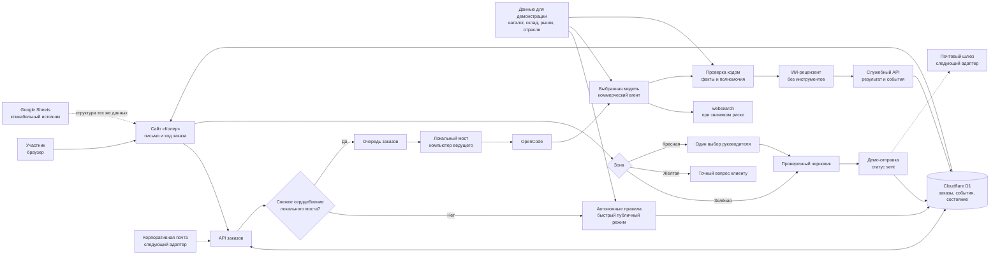
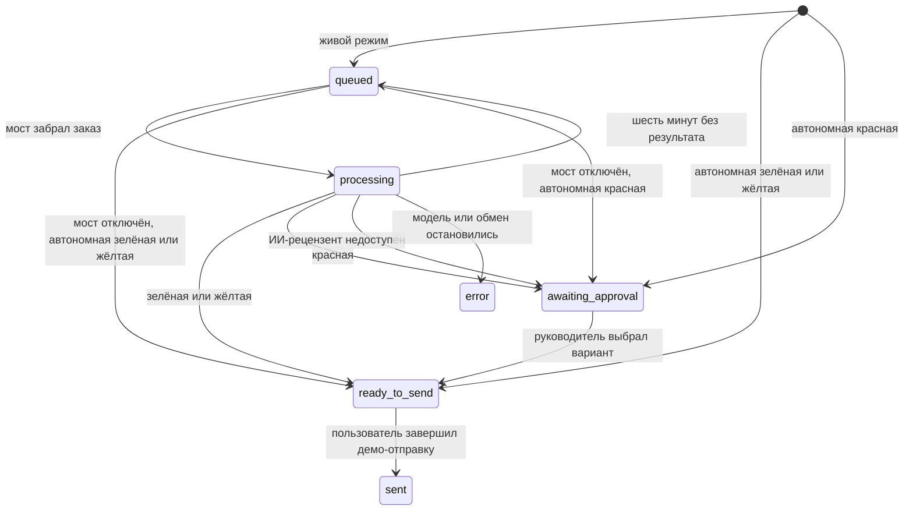

# Архитектура стенда «Колер» и рассказ для вебинара

## Короткий вывод

Стенд движется в верном направлении. Он показывает пять свойств агентной
системы, которые понятны руководителю без терминала:

1. система принимает свободный текст и сохраняет дело клиента;
2. модель понимает потребность и при необходимости исследует публичные
   источники;
3. код удерживает артикул, количество, остаток, цену и полномочия;
4. вторая модель проверяет коммерческий риск;
5. человек получает подготовленные варианты в точке реального выбора.

Главный эффект создаёт красная ветка. Агент обнаруживает риск, приносит
контекст, предлагает выполнимые ходы, ждёт один выбор руководителя и только
после этого собирает письмо.

Публичный стенд:
[koler-agent-demo.odinmaniac.chatgpt.site](https://koler-agent-demo.odinmaniac.chatgpt.site).

Демонстрационная таблица:
[«Колер» — данные стенда](https://docs.google.com/spreadsheets/d/1gabC2L8HOihMzPpp6pDeoMDtqXN9cEoGxwV-Al3PaYY/edit).

## Что видит участник

Страница строит один причинный рассказ:

```text
письмо → карточка → факты → исполнитель → зона → решение → демо-отправка → журнал
```

До формы участник видит:

- полный путь заказа;
- ссылку на Google-таблицу;
- каталог пяти продуктов;
- Markdown-инструкции;
- правила зелёной, жёлтой и красной зон;
- роль корпоративной почты в рабочем запуске.

После отправки участник видит:

- номер карточки;
- режим выполнения;
- выбранного исполнителя в живом режиме;
- последовательность наблюдаемых событий;
- распознанные факты;
- склад, цену, минимальную цену и демонстрационный рыночный срез;
- публичный контекст компании со ссылками, когда поиск влиял на решение;
- результат проверки второй модели либо автономных правил;
- готовое письмо или пульт руководителя;
- отдельное действие демо-отправки;
- дневные показатели.

Так экран заранее отвечает на три вопроса зрителя:

1. Что сейчас происходит?
2. Почему система выбрала этот ход?
3. Где человек сохраняет полномочия?

## Общая схема



## Где работает каждый слой

| Слой | Среда | Ответственность |
|---|---|---|
| Интерфейс | React на публичном сайте | Принимает письмо, показывает путь, источники, зоны, решение, демо-отправку и показатели |
| Сервер сайта | Cloudflare Worker через OpenAI Sites | Создаёт заказ, выдаёт состояние, принимает согласование и фиксирует демо-отправку |
| Хранилище | Cloudflare D1 | Хранит заказы, события, модели, решения, время отправки и сердцебиение |
| Автономные правила | Cloudflare Worker | Мгновенно обрабатывают заявки, когда локальный OpenCode отключён |
| Локальный мост | Компьютер ведущего | Забирает заказ, запускает OpenCode, пишет события и возвращает результат |
| Коммерческий агент | OpenCode и выбранная модель | Разбирает письмо, выбирает продукт, готовит контекст, варианты и клиентский текст |
| Веб-инструменты | OpenCode | Ищут публичные страницы компании и возвращают заявленные ссылки для проверки руководителем |
| Проверка кодом | Локальный мост | Заново подставляет каталожные числа и принудительно удерживает опасные случаи |
| ИИ-рецензент | OpenCode | Проверяет обязательства, цену, объём, источники и полномочия |
| Руководитель | Веб-интерфейс | Выбирает один вариант красного решения |

## Два режима выполнения

### Автономные правила

Публичный сайт всегда сохраняет работоспособный путь. Когда сервер давно не
получал сердцебиение локального моста, он обрабатывает письмо внутри Worker.

Автономный режим:

- использует те же пять продуктов, остатки, цены и правила;
- распознаёт свободный русский текст;
- строит зелёную, жёлтую или красную ветку;
- подбирает только явно разрешённые аналоги;
- показывает проверку правил;
- создаёт готовый черновик;
- ждёт руководителя в красной зоне;
- фиксирует демо-отправку и дневные показатели.

Модельный селектор в этом режиме служит подготовкой живого запуска. Интерфейс
прямо сообщает, что текущий ответ готовят автономные правила.

### Живой OpenCode

Локальный мост отправляет сердцебиение каждые 15 секунд. Сервер считает связь
активной 45 секунд. Новый заказ получает режим `opencode-live`, когда отметка
свежая.

Дальше система выполняет шаги:

1. сайт создаёт заказ со статусом `queued`;
2. мост забирает старейший заказ и переводит его в `processing`;
3. мост записывает выбранную модель и подключённые внутренние источники;
4. коммерческий агент получает письмо, данные и Markdown-инструкцию;
5. агент решает, нужен ли публичный веб-поиск;
6. код нормализует JSON и подтверждает факты;
7. ИИ-рецензент проверяет черновик;
8. результат возвращается в D1;
9. браузер обновляет карточку;
10. красный заказ ждёт выбора, остальные получают готовый черновик;
11. отдельная кнопка фиксирует демо-отправку.

Мост обрабатывает один заказ за раз. Каждый модельный вызов ограничен
120 секундами. Запросы к сайту получают отдельный лимит 12 секунд. После
остановки модельного вызова мост завершает зависший процесс принудительно и
удаляет временный файл. Для массовой практики аудитории подходит автономный
режим.

## Какие модели доступны

Стенд хранит точные идентификаторы моделей:

| Видимое имя | Идентификатор | Роль |
|---|---|---|
| DeepSeek V4 Flash | `opencode-go/deepseek-v4-flash` | быстрый исполнитель по умолчанию |
| DeepSeek V4 Pro | `opencode-go/deepseek-v4-pro` | исполнитель с более тщательной проверкой |
| GPT-5.6 Sol | `opencode/gpt-5.6-sol` | сильный проход и основной ИИ-рецензент |

Термин Flash на стенде означает DeepSeek V4 Flash. Интерфейс показывает
полное имя модели, поэтому зритель видит реальный выбор.

Выбранный идентификатор сохраняется в `requested_model`. Мост принимает только
модели из каталога. Когда основным исполнителем выбрана GPT-5.6 Sol,
ИИ-проверку выполняет DeepSeek V4 Pro. Во всех остальных живых запусках
ИИ-проверку выполняет GPT-5.6 Sol.

## Инструкции и права агента

В репозитории лежат три открытые Markdown-инструкции:

- `sales-agent.md` — понимание письма, источники, зоны, поиск, варианты и JSON;
- `reviewer.md` — блокирующие ошибки и коммерческая проверка;
- `improver.md` — инструкция для отдельного ручного прохода по журналу.

Редакция 5.6 датирована 28 июля 2026 года. GPT-5.6 Sol проверила инструкции,
после чего правила для слабых моделей стали конкретнее.

OpenCode запускает два ограниченных профиля:

| Профиль | Шаги | Доступ |
|---|---:|---|
| `koler-sales` | 7 | разрешён `websearch`, остальные инструменты запрещены |
| `koler-reviewer` | 2 | все инструменты запрещены |

Коммерческий агент ищет публичные источники и возвращает URL вместе с кратким
фактом. Код проверяет формат `http(s)`, руководитель открывает ссылку перед
решением. Журнал фиксирует вызов поиска и его назначение. Прямая проверка связи
между вызовом `websearch` и URL остаётся задачей рабочего адаптера.
ИИ-рецензент работает с уже собранными данными.

## Где работает недетерминированная логика

Модель принимает решения там, где полезно понимание смысла:

- распознаёт потребность из свободного письма;
- выбирает подходящий продукт по назначению;
- определяет недостающие факты;
- решает, нужен ли поиск компании;
- связывает бизнес клиента с риском заказа;
- предлагает несколько способов сохранить сделку;
- пишет короткий клиентский текст.

Код принимает решения там, где ошибка создаёт прямой коммерческий риск:

- извлекает явный артикул из исходного письма;
- берёт количество из исходного письма;
- останавливает неизвестный артикул;
- подставляет название, остаток, цену, минимальную цену и срок из каталога;
- пересчитывает сумму;
- включает красную зону при дефиците;
- включает красную зону при цене клиента ниже минимума;
- включает красную зону при скидке, отсрочке, штрафе, тендере, сроке «завтра»
  или «24 часа»;
- разрешает только заранее подтверждённые аналоги;
- удерживает отрицательную ИИ-проверку в красной зоне;
- удаляет спорный деловой вывод после отрицательной ИИ-проверки и сохраняет ссылки
  для ручной проверки;
- блокирует красное письмо до выбора руководителя.

Эта связка показывает практическую ценность агентности: модель расширяет
варианты, а система контролирует последствия.

## Источники и степень подключения

| Источник | Что работает сейчас | Что подключается в рабочей версии |
|---|---|---|
| Входящее письмо | участник пишет его в почтовой форме | Gmail API, Microsoft Graph, IMAP или почтовый webhook нормализуют письмо в тот же формат заказа |
| Каталог и склад | живая модель получает локальный снимок, автономный режим читает тот же файл | Google Sheets API, ERP или учётная система обновляют данные по расписанию или событию |
| Google-таблица | ссылка открывается со стенда и показывает структуру данных | сервис синхронизации становится источником текущих остатков |
| Рынок | демонстрационный срез содержит цену, срок и дату | отдельный инструмент получает разрешённые текущие источники |
| Компания клиента | живой агент ищет публичные страницы через OpenCode | корпоративные и платные источники добавляются отдельными разрешёнными инструментами |
| Исходящее письмо | кнопка записывает статус `sent` и событие | почтовый адаптер отправляет согласованный текст и сохраняет внешний идентификатор |

Во время вебинара ведущий может сказать:

> Сейчас форма играет роль входящей почты. Рабочий ящик подключается к той же
> точке приёма. Google-таблица показывает структуру склада, а стабильный снимок
> защищает эфир от случайного изменения данных.

## Зоны и полный цикл

### Зелёная зона

Условия:

- продукт подтверждён;
- существенные параметры указаны;
- весь объём есть;
- цена проходит минимальную границу;
- особые обязательства отсутствуют.

Цикл:

```text
письмо → проверка → зелёная зона → черновик → демо-отправка → sent
```

### Жёлтая зона

Условия:

- не хватает количества, цвета или условий эксплуатации;
- артикул отсутствует в каталоге;
- совместимость требует подтверждения.

Агент сохраняет известные факты, формулирует точные вопросы и предлагает
ближайший безопасный ход.

Цикл:

```text
письмо → пробел → жёлтая зона → письмо с вопросами → демо-отправка → sent
```

Текущий стенд завершает жёлтый показ письмом с вопросами. Ответ клиента
запустит следующий расчёт после подключения входящего почтового адаптера;
существующая карточка пока не принимает ответ клиента.

Приоритет маршрута задают подтверждённые факты. Неизвестный продукт или
отсутствующий объём ведут в жёлтую зону. Подтверждённые продукт и объём
позволяют жёсткому коммерческому риску сохранить красную зону даже при
отсутствующем цвете или среде.

### Красная зона

Условия:

- остатка меньше запроса;
- клиент просит цену ниже минимума;
- есть скидка, отсрочка, штраф, тендер, срок «завтра» или «24 часа»;
- вторая модель нашла блокирующую ошибку.

Живая модель может распознать другие необычно короткие сроки. Автономные
правила ограничиваются двумя явными формулировками выше.

Агент приносит:

- причину границы;
- проверенные числа;
- рыночный и отраслевой контекст;
- публичные источники, когда они влияют на решение;
- от двух до трёх выполнимых вариантов;
- пользу и компромисс каждого варианта;
- готовый текст для каждого варианта.

Цикл:

```text
письмо → риск → красная зона → один выбор → согласование
→ готовое письмо → демо-отправка → sent
```

## Состояния заказа



Интерфейс переводит служебные значения в деловые статусы:

- `queued` — ждёт свободного исполнителя;
- `processing` — модель готовит решение;
- `awaiting_approval` — ждёт решения руководителя;
- `ready_to_send` — готово к отправке;
- `sent` — демо-отправка зафиксирована в D1;
- `error` — работа остановлена.

При сбое ИИ-рецензента код сохраняет проверенный черновик, переводит его в красную
зону и передаёт руководителю безопасные варианты. При другой ошибке карточка
сохраняет письмо и журнал, показывает следующий ход и возвращает участника к
форме.

Служебный API закрывает каждый активный журнальный шаг: результат переводит
его в `done`, ошибка — в `error`. Если мост отключился, карточка старше минуты
переходит из `queued` или `processing` к автономным правилам при следующем
чтении браузером. Мост также возвращает шестиминутный зависший заказ в
`queued`, когда снова начинает опрашивать очередь.

## Хранилище и маршруты

D1 содержит три таблицы.

### `orders`

Ключевые поля:

- `id`, `subject`, `body`, `company`, `website`;
- `status`, `zone`, `mode`;
- `result_json`, `manager_decision`;
- `agent_model`, `reviewer_model`, `requested_model`;
- `sent_at`, `created_at`, `updated_at`.

### `order_events`

Каждая строка хранит:

- заказ;
- этап;
- заголовок;
- открытое описание;
- состояние;
- время.

### `system_state`

Сейчас таблица хранит сердцебиение локального моста.

Основные маршруты:

| Маршрут | Действие |
|---|---|
| `POST /api/orders` | создаёт заказ и выбирает режим |
| `GET /api/orders?id=…` | возвращает карточку и события |
| `GET /api/orders?system=1` | возвращает доступность OpenCode и каталог моделей |
| `GET /api/orders?stats=1` | возвращает показатели дня |
| `PATCH /api/orders` | согласует один вариант или фиксирует демо-отправку |
| `GET /api/agent` | выдаёт локальному мосту старейший заказ |
| `POST /api/agent` | принимает сердцебиение, событие, результат или ошибку |

Служебные маршруты моста требуют `BRIDGE_TOKEN`. Сервер отказывает при
отсутствующем секрете.

## Журнал и ручное улучшение системы

Стенд сохраняет наблюдаемые события:

- приём письма;
- выбор исполнителя;
- подключение каталога и рынка;
- открытие публичного источника;
- найденный контекст компании;
- запуск ИИ-рецензента;
- выбранную зону;
- решение руководителя;
- демо-отправку;
- ошибку.

Скрытые рассуждения моделей в журнал не входят.

Ведущий вручную запускает отдельный проход сильной модели по журналу после
серии заказов. Инструкция `improver.md` просит предложить:

1. правку инструкции;
2. новое жёсткое правило;
3. изменение каталога;
4. проверку на прежних заказах.

Так дневной счётчик даёт вход ручному циклу улучшения:

```text
заказы → наблюдаемые события → повторяющийся сбой → правка
→ прогон прежних заказов → новая редакция
```

## Безопасность демо

Уже реализовано:

- служебный API защищён отдельным секретом;
- модель выбирается из белого списка;
- коммерческий агент получает только `websearch`;
- ИИ-рецензент не получает инструментов;
- промпт передаётся OpenCode через временный файл с правами `0600`;
- временный файл удаляется после вызова;
- дочерний процесс получает сокращённый набор переменных окружения;
- пользовательский текст не попадает в список аргументов процесса;
- сетевые запросы и модельные вызовы имеют жёсткие лимиты времени;
- зависший модельный процесс получает `SIGTERM`, затем `SIGKILL`;
- код повторно проверяет результат модели;
- сбой ИИ-рецензента переводит карточку к ручному решению;
- отрицательная ИИ-проверка удаляет неподтверждённый деловой контекст и оставляет
  ссылки для проверки;
- активный журнальный шаг завершается при результате или ошибке;
- зависший заказ возвращается в очередь через шесть минут;
- красное решение требует явного выбора;
- демо-отправка отделена от согласования.

Для промышленного запуска потребуются:

- авторизация участника и роль руководителя;
- ограничение частоты запросов;
- срок хранения и очистка данных;
- атомарная аренда задания для нескольких мостов;
- идемпотентная почтовая отправка;
- централизованные метрики и оповещения;
- журнал доступа к чувствительным источникам.

## Проверка исходной задачи

| Цель | Текущее соответствие | Что увидит зритель |
|---|---|---|
| Показать пользу агентных действий | высокая | заказ живёт между шагами, модель исследует веб, запускает ИИ-проверку и ждёт человека |
| Показать свободный ввод | высокая | 30 писем и собственный текст проходят один путь |
| Показать недетерминированное преимущество | высокая в живом режиме | модель понимает смысл, строит контекст и варианты |
| Показать коммерческую границу | высокая | дефицит, цена и условия блокируют отправку |
| Сохранить ясность для нон-кодера | высокая | первый экран объясняет путь, каждый факт открывается рядом с решением |
| Дать аудитории покликать | высокая в автономном режиме | быстрые зелёная, жёлтая и красная ветки не создают общую очередь |
| Подключить настоящую почту | подготовлена точка расширения | форма и демо-отправка используют будущий формат адаптеров |
| Использовать живой Google Sheets | подготовлена точка расширения | таблица кликабельна, runtime читает стабильный снимок |
| Отправлять настоящее письмо | подготовлена точка расширения | действие и статус готовы, почтовый шлюз подключается последним шагом |

Стенд уже доказывает полезность управляемой агентной системы. Рабочее внедрение
добавит корпоративные источники, роли, почтовые адаптеры и эксплуатационные
гарантии.

## Взаимосвязанный сценарий вебинара

Каждый фрагмент готовит следующий.

```text
карта системы
  ↓ даёт язык для наблюдения
зелёная заявка
  ↓ создаёт доверие к скорости и фактам
жёлтая заявка
  ↓ показывает умение остановиться и сохранить ход
красная заявка
  ↓ раскрывает бизнес-ценность вариантов и границу человека
сравнение моделей
  ↓ показывает роль сильной инструкции и жёсткого кода
журнал
  ↓ объясняет накопление качества
результат дня
  ↓ переводит один пример в масштаб отдела
```

### 1. Дать карту

Показать первый экран, пройти семь шагов глазами, открыть Google-таблицу,
каталог и Markdown-инструкцию.

Реплика:

> Письмо получает номер и историю. Модель понимает запрос, источники
> подтверждают числа, зона определяет полномочия, журнал сохраняет результат.

### 2. Провести зелёную заявку

Выбрать «Заказ с полными данными», отправить первое письмо, открыть продукт,
проверить остаток и цену, завершить демо-отправку.

Вывод для зрителя: стандартная работа проходит быстро и прозрачно.

### 3. Провести жёлтую заявку

Выбрать «Заявка с пробелом», показать предварительную подсказку и отправить.
Прочитать список недостающих фактов и клиентский вопрос.

Вывод для зрителя: система сохраняет клиента и сокращает уточнение до одного
следующего шага.

### 4. Провести красную заявку живой моделью

Подключить OpenCode, выбрать Flash, взять компанию с реальным доменом и
отправить крупный заказ. В ленте показать веб-поиск, каталог, ИИ-проверку и красную
зону.

Вывод для зрителя: агент приносит руководителю решение вместе с основанием.

### 5. Выбрать один вариант

Сравнить пользу и компромисс двух или трёх вариантов, выбрать один,
согласовать, увидеть обновлённый текст и отдельно завершить демо-отправку.

Вывод для зрителя: человек принимает короткое содержательное решение.

### 6. Сопоставить модели

Оставить первую карточку в отдельном окне или сохранить её снимок. Затем
открыть новую карточку с тем же письмом, выбрать DeepSeek V4 Pro либо GPT-5.6
Sol и сравнить факты, варианты и замечания. Стенд показывает одну активную
карточку в окне и не хранит пользовательский экран истории заказов.

Вывод для зрителя: качество создают модель, инструкция, источники, код и
ИИ-проверки.

### 7. Открыть журнал и результат дня

Показать карточку глазами агента, список событий и дневные показатели.

Вывод для зрителя: система создаёт управляемый процесс отдела и материал для
следующей редакции.

### 8. Завершить вопросом переноса

Предложить участникам мысленно заменить:

- краски на свой каталог;
- остатки на свою учётную систему;
- зоны на свои полномочия;
- письмо на свой входящий канал;
- пульт руководителя на своё решение.

Так желание продолжить возникает из ясной картины собственного процесса.

## Режим проведения для аудитории

Самая устойчивая последовательность:

1. до эфира запустить локальный мост и проверить живой индикатор;
2. провести одну красную заявку через реальные модели;
3. согласовать вариант и зафиксировать демо-отправку;
4. остановить мост;
5. дождаться надписи «Демо-режим»;
6. отправить ссылку аудитории;
7. предложить каждому пройти зелёный, жёлтый и красный примеры;
8. вернуться к дневным показателям.

Один локальный мост обрабатывает очередь последовательно. Автономный режим
даёт каждому участнику быстрый личный цикл.

## Чек-лист перед эфиром

- [ ] Публичный адрес открывается в отдельном браузере.
- [ ] Google-таблица открывается по ссылке со стенда.
- [ ] В каталоге видны пять продуктов, остаток, цена и минимум.
- [ ] В селекторе идут полный заказ, заявка с пробелом, особые условия.
- [ ] Кнопка «Другой пример» проходит десять писем в каждой группе.
- [ ] Все 30 подготовленных писем попадают в ожидаемую зону.
- [ ] Живой мост показывает «OpenCode подключён».
- [ ] DeepSeek V4 Flash выполняет один заказ.
- [ ] GPT-5.6 Sol выполняет ИИ-проверку.
- [ ] Реальный домен создаёт события веб-поиска и ссылки.
- [ ] Красный черновик не содержит выбранного условия до согласования.
- [ ] Радиовыбор разрешает согласовать один вариант.
- [ ] После согласования появляется готовый текст.
- [ ] Демо-отправка переводит заказ в `sent`.
- [ ] Счётчики дня обновляются.
- [ ] После остановки моста включается быстрый режим.
- [ ] Широкая и мобильная версии сохраняют порядок пути.

## Короткая реплика ведущего

> Клиент пишет обычное письмо. Система создаёт карточку, модель понимает
> потребность, каталог подтверждает числа, веб-поиск добавляет контекст, вторая
> модель ищет риск. Стандартный ответ проходит к отправке. Неясный запрос
> получает точные вопросы. Рискованный заказ приходит руководителю с готовыми
> вариантами. Журнал сохраняет каждый наблюдаемый шаг и даёт материал для
> следующего улучшения.

Применён принцип целостности пути: вход, решение человека и результат собраны
в одной системе — [Бюро Горбунова](https://bureau.ru/soviet/20181231/).
