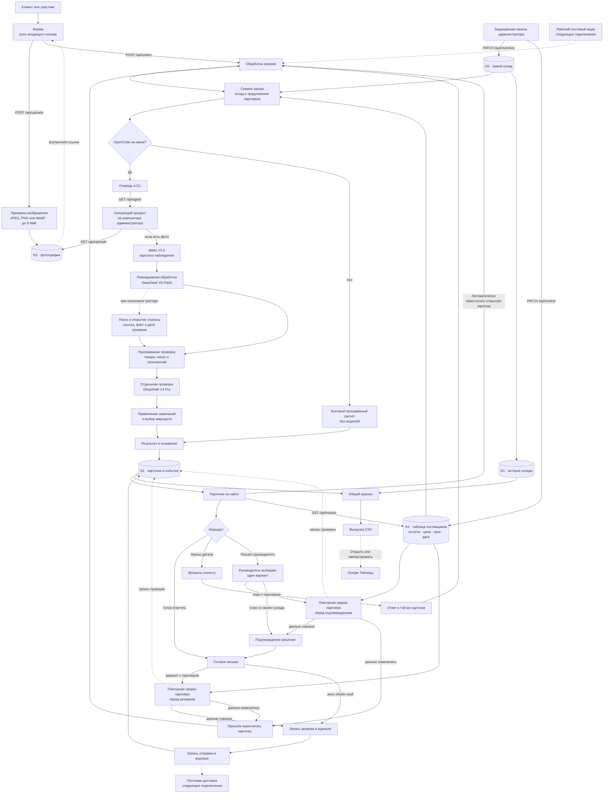
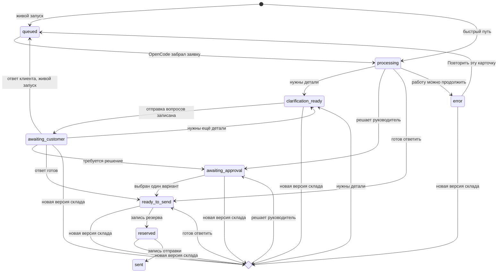

# Архив v1: архитектура системы «Колер» и сценарий вебинара

> Историческая версия. Не является активным операторским runbook, статусом
> готовности или источником текущего runtime-контракта.

## Коротко

Демонстрация показывает, как агент ведёт заявку от письма до одного из трёх
результатов: готовое письмо, точные вопросы клиенту или варианты для
руководителя. По пути он читает склад, проверяет цену и сохраняет источники.
Когда своего запаса мало, агент собирает полную поставку из нашей партии и
партии другого поставщика, сравнивает сроки и приносит руководителю готовый
вариант.

«Колер» показывает этапы входящей заявки:

```text
описание заказа и фото по желанию → понимание задачи → живые факты → сведения о клиенте
→ следующий шаг → действие человека → письмо → общая история
```

Система отвечает на четыре вопроса зрителя:

1. Что агент делает сам?
2. На каких фактах он строит решение?
3. Где руководитель сохраняет полномочия?
4. Как новый остаток на своём складе или у партнёра меняет следующий ответ?

Основной эпизод вебинара проходит в одной карточке ГК «ПРОТЕК». Агент уточняет
назначение помещения, рассчитывает 620 кг, видит 420 кг на складе «Колера» и
сравнивает три предложения других поставщиков. Сначала он выбирает
«Индустрию Покрытий»: в таблице поставщиков доступно 260 кг, для заказа нужно
200 кг. Администратор уменьшает доступный объём партнёра до 150 кг. Агент запускает
новый круг, выбирает выполнимый вариант у другого поставщика и обновляет
письмо. После возврата 260 кг прежний вариант снова становится лучшим. Затем
администратор увеличивает собственный остаток с 420 до 700 кг, и агент собирает весь
заказ со склада «Колера». Экран сохраняет все решения и письма рядом.

Предложения партнёров, цены и остатки созданы для вебинара и управляются
администратором. Строка в таблице служит основанием для расчёта. Поставщик подтверждает
фактический объём и срок, технолог подтверждает цвет и совместимость
материалов. Система записывает подготовку резерва в журнал; фактический резерв
появляется после подключения системы поставщика.

При живой связи OpenCode запускает DeepSeek V4 Flash для обработки заказа,
затем DeepSeek V4 Pro для отдельной проверки. GPT-5.6 Sol используется только
при подготовке и улучшении инструкций и никогда не получает заказы. При
остановке связи карточку пересчитывает сервер без моделей.
Короткий дополнительный эпизод с краской для дерева показывает тот же переход
при изменении остатка с 40 до 180 кг.

Форма на странице играет роль входящей почты. Рабочая входящая и исходящая
почта остаются следующим подключением.

- Публичная демонстрация:
  [koler-agent-demo.odinmaniac.chatgpt.site](https://koler-agent-demo.odinmaniac.chatgpt.site/)
- Общая таблица:
  [данные системы «Колер»](https://docs.google.com/spreadsheets/d/e/2PACX-1vR7jeOl2r8s8mHvuFEkhJgG9F9kRiUknVTDG_Qt7RwX3nzj8AtVJihpdhX1kxxXCULV3d5D1xhUNBmU/pubhtml)

## Спецификация приёмки

Демонстрация считается готовой к вебинару, когда участник проходит наблюдаемый цикл
без терминала:

| Часть цикла | Проверяемый результат |
|---|---|
| Вход | Форма принимает компанию, сайт, тему, свободный текст и необязательное фото; тридцать примеров идут в порядке «Готов ответить» → «Нужны детали» → «Решает руководитель» |
| Покупатель без опыта | Запрос про забор работает без марки краски и массы: агент уточняет материал, размеры, стороны и цвет, затем считает площадь, расход и упаковки |
| Подбор с учётом компании | Запрос «нужна краска для пола» использует сведения с официального сайта компании; агент формулирует проверяемое предположение, связывает вариант со свойствами каталога и задаёт один вопрос о материале, назначении, уборке и нагрузке |
| Готовый заказ | Карточка показывает товар, свежий остаток, цену, сумму и письмо; действия резерва и отправки создают записи в журнале |
| Уточнение | Вопросы попадают в журнал; ответ клиента продолжает карточку под тем же номером и заменяет прежние неясные или исправленные данные |
| Решение руководителя | Агент приносит два-три варианта с последствиями для клиента и завода и готовым письмом; руководитель выбирает один вариант |
| Честное обещание | До решения руководителя карточка называет совместную поставку расчётом. После выбора она показывает одобренный план и отдельно перечисляет подтверждения поставщика и технолога |
| Живой склад | Каждая карточка хранит номер обновления склада; новый остаток пересчитывает активную карточку и сохраняет прежнее решение рядом |
| Помощь при дефиците | Для заказа 620 кг агент сравнивает три строки таблицы поставщиков, оставляет два варианта с полным недостающим объёмом и выбирает поставщика по сроку, затем по цене. Карточка показывает 420 кг «Колера» по 415 ₽/кг, возможные 200 кг партнёра по 402 ₽/кг, расчёт 254 700 ₽ и выигрыш шести дней после подтверждений |
| Живое предложение партнёра | D1 хранит текущие доступные объёмы партнёров. Переход 260 → 150 кг запускает новый круг, прежний вариант уступает следующему выполнимому предложению. Возврат 150 → 260 кг снова меняет решение |
| Свежесть предложения партнёра | Перед решением руководителя, записью резерва и записью отправки сервер повторно сверяет выбранного поставщика, объём, цену, срок и дату проверки. Новые данные возвращают карточку к пересчёту, каждая сверка остаётся в журнале |
| Цена | Карточка сопоставляет цены из таблицы поставщиков с нашей ценой и раскрывает основание вывода о марже |
| Компания | `koler-sales` получает `websearch` и `webfetch` по трём точным триггерам; каждый факт влияет на решение только после открытия страницы, а ссылка и дата сохраняются в карточке |
| Роли | Инструкция MiMo задаёт правила наблюдения, программа ограничивает поля и размер; DeepSeek V4 Flash ведёт заказ; DeepSeek V4 Pro отдельным запуском проверяет решение; программа сверяет числа; GPT-5.6 Sol готовит и улучшает инструкции вне потока заказов |
| Общая история | Заявка, письма, действия, склад, решения и итог дня входят в CSV и общую Google-таблицу |
| Граница демонстрации | Форма заменяет входящую почту; публичные действия отправки и резерва записываются в журнал без почтовой доставки и резерва в учётной системе |

## Что видит участник

Первый экран до формы показывает путь заявки:

- путь заказа от почты до общей истории;
- три маршрута в порядке зелёный → жёлтый → красный: «Готов ответить»,
  «Нужны детали», «Решает руководитель»;
- живой каталог и остатки;
- три правила продаж простыми словами;
- распределение работы между моделью, программой и руководителем;
- ссылку на общую Google-таблицу.

Правила сразу объясняют границы:

1. Всё понятно, товар есть на складе, цена приносит нужную прибыль — агент
   готовит ответ.
2. Для подбора или расчёта не хватает факта — агент спрашивает только
   недостающее.
3. Склад подтверждает часть объёма, клиент просит особую цену, оплату после
   поставки или жёсткий срок — агент приносит руководителю варианты с
   последствиями и готовым письмом.

В форме участник может:

- выбрать один из тридцати примеров;
- написать собственную заявку;
- указать компанию и сайт;
- выбрать готовый пример с уже приложенной фотографией забора;
- открыть пример ГК «ПРОТЕК», где сведения о компании меняют вопрос и предварительный подбор краски для пола;
- приложить, заменить или убрать собственное изображение;
- увидеть живую обработку DeepSeek V4 Flash и отдельную проверку DeepSeek V4 Pro
  при подключённом OpenCode.

После создания карточка показывает:

- номер и круг переписки;
- исходное письмо и вложение;
- ход действий;
- понятые факты;
- сохранённый снимок своего склада и предложений других поставщиков;
- товар, количество, цену и сумму;
- положение цены среди предложений;
- деловой контекст;
- проверяемые основания выводов;
- вопросы клиенту, варианты руководителю или готовое письмо;
- состояние отправки;
- запись в общем журнале.

## Общая схема



## Слои и среда выполнения

| Слой | Где работает | Ответственность |
|---|---|---|
| Интерфейс React и Next.js | Браузер и сайт в OpenAI Sites | Форма-письмо, карточка, маршруты, пульт, журнал и модальные источники |
| Серверные маршруты | Cloudflare Worker в публикации OpenAI Sites | Загрузка фото, создание карточек, переходы состояний, статистика, склад, предложения партнёров, журнал и служебная очередь |
| Drizzle и Cloudflare D1 | Облачная база системы | Карточки, переписка, события, остатки своего склада, строки таблицы поставщиков и решения руководителя |
| Cloudflare R2 | Облачное хранилище системы | Исходные байты пользовательских фотографий по случайным внутренним ключам |
| Демонстрационный расчёт | Cloudflare Worker | Быстрый маршрут, уточнения, расчёт площади и серверный пересчёт склада |
| Связующий процесс | Node.js на компьютере администратора | Сердцебиение, получение очереди, безопасная загрузка фото, запуск OpenCode, запись событий и результата |
| OpenCode | Компьютер администратора | Передаёт фото в MiMo V2.5, запускает DeepSeek V4 Flash для обработки заказа, разрешает поиск и передаёт результат в DeepSeek V4 Pro для отдельной проверки |
| Подготовленные данные | Поставка сайта | Каталог, исходные цены и сроки партнёров, правила, профили компаний и готовые примеры |
| Google Таблицы | Внешняя ссылка | Общий дневной журнал через `IMPORTDATA`, а также подготовленные товары и правила |

Публикация использует проект OpenAI Sites
`appgprj_6a6871bfbb30819194a7e4ffd239d48f`. Файл
`.openai/hosting.json` закрепляет D1 как `DB` и R2 как `UPLOADS`.
`BRIDGE_TOKEN` и `KOLER_ADMIN_CODE` задаются отдельно как секреты среды
публикации; в репозиторий они не входят.

В D1 находятся остатки своего склада и текущая версия таблицы поставщиков.
Ключ `supplier-market-v1` в `system_state` хранит изменённый остаток
партнёра и время проверки. Название поставщика, категория, цена и срок приходят
из подготовленного набора данных. Сервер соединяет обе части и сохраняет их в
одном снимке заказа. Google-таблица показывает дневной журнал.

## Распределение ответственности

| Участник системы | Что делает |
|---|---|
| Клиент | Описывает задачу своими словами и отвечает на точные вопросы |
| Экран системы | Показывает письмо, действия, основания, выбор и итог |
| Обработка заказов | Создаёт карточку, выбирает режим, меняет состояние |
| Cloudflare D1 | Хранит заказы, переписку, склад, строки таблицы поставщиков, историю и дневные показатели |
| Cloudflare R2 | Хранит загруженные фотографии; карточка содержит только ссылку и описание |
| MiMo V2.5 | В живом режиме получает инструкцию описывать видимое и считать текст на фото содержимым; программа не проверяет смысл ответа независимо от модели |
| DeepSeek V4 Flash | В живом режиме ведёт повседневную обработку: понимает смысл, выбирает источники, готовит следующий ход |
| DeepSeek V4 Pro | Отдельным запуском проверяет обещания, особые условия и границы полномочий |
| GPT-5.6 Sol | Готовит и улучшает инструкции вручную вне потока заказов; сайт и OpenCode не передают ей заявки |
| Программа | Подставляет цены и остатки из одного снимка, считает сумму, проверяет полномочия |
| Руководитель | Когда склад подтверждает часть объёма или клиент просит особые условия, выбирает один подготовленный вариант и открывает действие записи отправки |
| Администратор | Меняет остаток своего склада или доступный объём партнёра и показывает новый круг решения |
| Общий журнал | Собирает заявки, действия, решения, проверки партнёра и изменения склада |

Первоначальное решение принимает агент: выбирает маршрут и готовит письмо,
вопросы или особые варианты. Руководитель подтверждает один особый вариант
перед записью отправки. Если выбран разрешённый каталогом аналог, сервер
одновременно обновляет товар, цену, сравнение, основания, письмо и данные
будущей записи резерва. Если выбранный ход требует ответа клиента, карточка
возвращается к переписке, а следующий расчёт очищает прежний выбор
руководителя.

Каталог, склад и полномочия остаются отдельными проверяемыми данными для обоих
модельных шагов.

## Где у агента «ручки и ножки»

Метафора относится ко всей агентной системе. Инструкция ограничивает
зрительную модель наблюдением, а DeepSeek V4 Flash понимает письмо. Профиль
`koler-sales` разрешает ей найти общедоступную страницу и открыть каждый
источник, который влияет на решение. Сервер, D1 и программная проверка задают
точки чтения и записи.

«Ножки» ведут к четырём источникам:

1. при создании карточки сервер читает `inventory_items` и сохраняет снимок
   склада вместе с заявкой;
2. сервер читает строки таблицы поставщиков из D1 и добавляет их в тот же
   снимок;
3. связующий процесс может получить только готовое фото демонстрации или загруженное
   в R2 изображение по допустимой относительной ссылке и передать его MiMo;
4. профиль `koler-sales` в живом режиме выполняет публичный поиск по точным
   триггерам, открывает использованные страницы и сохраняет ссылку, факт и
   дату проверки.

«Ручки» выполняют наблюдаемые действия:

1. `POST /api/uploads` проверяет фото и сохраняет его в R2;
2. `POST /api/orders` создаёт карточку и первое событие;
3. MiMo готовит наблюдение по фото, а связующий процесс ограничивает поля и
   размер ответа и записывает события этого шага;
4. DeepSeek V4 Flash готовит вопросы, расчёт, варианты или письмо;
5. программа подставляет товар, цену и остатки своего склада и партнёров из
   сохранённого снимка и проверяет маршрут;
6. отдельный запуск DeepSeek V4 Pro отмечает условие,
   которое выбирает руководитель, а программная проверка переводит карточку к
   этому решению;
7. связующий процесс записывает события и результат через `/api/agent`;
8. действия `send_clarification`, `customer_reply`, `recalculate`, `approve`
   и `send` меняют состояние прежней карточки через `PATCH /api/orders`;
9. `GET /api/market` показывает текущие строки таблицы поставщиков, а защищённый
   `PATCH /api/market` меняет остаток выбранного партнёра;
10. изменение своего склада или партнёрского предложения запускает новый круг
    той же карточки;
11. `/api/ledger` собирает карточки, события и изменения склада в одну историю.

Права остаются явными. Администратор управляет остатками, особый вариант
подтверждает руководитель, поставщик подтверждает фактический объём и срок,
технолог подтверждает совместимость. Рабочая входящая и исходящая почта
остаются следующим подключением. Модель готовит расчёт, варианты и письмо в
заданных пределах.

## Наблюдаемые действия

Система сохраняет последовательность наблюдаемых действий:

| Что показывает администратор | Наблюдаемое действие системы |
|---|---|
| У заявки появляется номер, состояние и круг переписки | Система создаёт долговечную карточку в D1 |
| Пользовательское фото появляется в карточке, а в живом журнале видны наблюдение по фото или подготовленные вопросы клиенту | Система сохраняет вложение в R2 и выполняет отдельный ограниченный зрительный шаг |
| Рядом с решением указан остаток и номер его обновления | Система прочитала внешний источник и сохранила снимок |
| Остаток выбранного партнёра меняется с 260 до 150 кг | Система запускает новый круг, отказывается от устаревшего расчёта и выбирает следующий выполнимый вариант |
| Администратор возвращает партнёру 260 кг | Система снова сравнивает все предложения и возвращает более быстрый вариант |
| При живом OpenCode в журнале появляются поиск и открытие страницы | Рабочая модель нашла источник, открыла страницу и сохранила подтверждённый факт вместе со ссылкой |
| Подготовленные сведения с официального сайта показывают фармацевтическую и складскую деятельность | Агент предполагает назначение помещения, связывает КР-003 с подтверждёнными свойствами и просит одной фразой описать материал пола, уборку и нагрузку |
| Вопросы уходят в ту же карточку, ответ клиента продолжает расчёт | Система удерживает задачу между несколькими сообщениями |
| Изменение 40 → 180 кг отмечается на старой карточке | Система замечает новый внешний факт |
| Автоматический пересчёт меняет маршрут руководителя на готовый ответ | Система заново оценивает действие по свежему факту |
| Скидка, частично подтверждённый объём или отсрочка закрывают действие записи отправки | Система соблюдает границу полномочий |
| Склад подтверждает часть объёма, клиент просит оплату после поставки | Агент учитывает оба условия и предлагает разделить поставку и оплату по партиям |
| Руководитель подтверждает один подготовленный вариант | Человек управляет обязательством компании |
| Карточка, события и склад попадают в дневной CSV | Команда получает общую историю дня для проверки и улучшения |

Сценарий вебинара проходит эту цепочку на экране и связывает письмо с
сохранёнными действиями.

## Два режима выполнения

### Быстрый путь опубликованной версии

Когда локальный OpenCode отключён, сервер вызывает программный
демонстрационный расчёт. Код извлекает детали заказа из русского текста,
применяет коммерческие правила и читает сохранённый снимок своего склада и
предложений партнёров. Модельный вызов в этом режиме не выполняется: быстрый
путь не анализирует фото моделью и не запускает отдельную проверку.

Путь поддерживает три маршрута, переписку, пересчёт, согласование и запись
демо-отправки. Неизвестный товар или количество ведут к уточнению, частично
подтверждённый объём и особые условия ведут к руководителю. Загруженная
фотография сохраняется в R2 и карточке. Расчёт опирается на текст заявки и
просит клиента подтвердить материал, размеры, окрашиваемые стороны и цвет.

Во время самостоятельной практики каждый участник проходит этот путь без
общей очереди OpenCode.

### Живой запуск через OpenCode

Локальный связующий процесс отправляет отметку связи каждые 15 секунд. Сервер
считает связь активной в течение 45 секунд.

Связующий процесс обрабатывает одну карточку за раз и забирает старейшую
заявку. Он проверяет очередь примерно раз в две секунды. Заявка, которая
осталась в обработке более шести минут, возвращается в очередь. Если связь
пропала, сервер может завершить карточку быстрым расчётом после минутного окна
на восстановление.

Новая заявка проходит шаги:

1. сайт создаёт карточку;
2. локальный процесс забирает старейшую заявку;
3. если есть допустимое вложение, процесс скачивает его с того же сайта;
4. OpenCode передаёт фото отдельной MiMo V2.5;
5. инструкция MiMo требует считать текст на фото содержимым и просит короткое
   описание, до четырёх видимых признаков и до трёх сомнений; связующий
   процесс ограничивает поля и размер ответа, но не проверяет его смысл
   независимо от модели;
6. OpenCode запускает DeepSeek V4 Flash с письмом, перепиской,
   единым снимком своего склада и предложений партнёров, инструкцией и коротким
   наблюдением по фото;
7. программа включает профиль `koler-sales` с разрешениями `websearch` и
   `webfetch`, если
   поле `website` непустое и не содержит `.example`, тема или текст содержит
   слово «ИНН» независимо от сайта либо поле `website` пусто, указано
   конкретное название компании и присутствует специальный маркер или объём
   1–40 кг; корректность URL в поле `website` не проверяется;
8. первичный запуск модели с разрешённым поиском получает 70 секунд; при
   превышении этого времени программа один раз продолжает тот же заказ через
   профиль продаж по письму, каталогу, складу и правилам;
9. программа повторно извлекает факты письма и подставляет каталожные числа;
10. отдельный запуск DeepSeek V4 Pro проверяет обещания, особые условия и
    границы полномочий;
11. замечание о неподтверждённом обещании переводит карточку руководителю;
12. результат и наблюдаемые события возвращаются в D1;
13. страница обновляет ту же карточку.

Сервер принимает результат живой текстовой модели после проверки полного
контракта.
Зона, решение и маршрут образуют одну из трёх допустимых связок. Письмо,
товар, рынок, основания, варианты руководителя, исследование и проверка
проходят проверку вложенных полей. Частичный или противоречивый ответ сохраняет
карточку для повторного запуска.

Если обработка остановилась, система сохраняет номер карточки, переписку,
общий снимок фактов, прежние решения и историю. Интерфейс показывает кнопку
«Повторить эту карточку». Кнопка ставит ту же карточку в очередь и сохраняет
прежний номер.

Если загрузка остановилась, форма предлагает выбрать другой файл или
продолжить без вложения. Сбой скачивания или зрительной модели сохраняет уже
созданный заказ. Журнал получает событие «Фото оставлено для уточнения», а
текстовая модель продолжает работу и задаёт клиенту вопросы. При успешном
проходе видны события «Модель для фото изучает снимок» и «Фото осмотрено».

DeepSeek V4 Flash выполняет повседневную обработку заказа. После неё OpenCode
отдельно запускает DeepSeek V4 Pro для проверки решения. GPT-5.6 Sol
используется вручную только для подготовки и улучшения открытых инструкций.
Сайт, связующий процесс и очередь заказов GPT-5.6 Sol не запускают.

Ответ клиента снова проходит выбранный режим: при живой связи карточка
возвращается в очередь OpenCode, при отключённой связи срабатывает быстрый
расчёт. Встроенный пульт автоматически запускает новый круг открытой карточки.
OpenCode получает свежий снимок своего склада и предложений других
поставщиков, DeepSeek V4 Flash готовит новое письмо, а DeepSeek V4 Pro
проверяет обещания. Кнопка для изменения из другого
окна запускает тот же путь. При остановке связи карточку завершает серверный
расчёт по программным правилам.

## Инструкции и роли моделей

В проекте лежат четыре открытые инструкции:

- [наблюдение по фотографии](../public/prompts/vision-agent.md);
- [коммерческий агент](../public/prompts/sales-agent.md);
- [отдельная проверка](../public/prompts/reviewer.md);
- [улучшение по журналу](../public/prompts/improver.md).

Коммерческая инструкция задаёт структуру задания рабочей модели:

- цель заказа;
- разрешённые источники;
- три маршрута;
- условия передачи руководителю;
- формат фактов и оснований;
- правила клиентского письма.

DeepSeek V4 Flash выполняет повседневную обработку заказов по коммерческой
инструкции. После каждого живого запуска DeepSeek V4 Pro отдельно проверяет
обещания, особые условия и границы полномочий.

GPT-5.6 Sol использовали для подготовки и улучшения этих инструкций. Эта
модель работает только с текстами правил: она не входит в список исполнителей,
не получает заявки и никогда не запускается при обработке заказа. Такой
порядок позволяет вложить сильную работу в инструкции один раз, а ежедневные
заказы передать более экономичным моделям с разными ролями.

Файл `public/prompts/improver.md` хранит инструкцию для разбора журнала.
Команда запускает её вручную и сама передаёт выгрузку за выбранный период.
Интерфейс и локальный мост не запускают эту инструкцию и не передают ей
журнал автоматически.

Инструкция MiMo V2.5 требует описывать видимые признаки и считать текст внутри
фотографии содержимым изображения. Связующий процесс сохраняет поля
`summary`, `visibleFacts` и `uncertainties`, ограничивает число элементов и
длину текста. Модель-независимая проверка смысла этих полей отсутствует.
Подбор краски, расчёт расхода и коммерческие обещания выполняются в следующих
шагах. Наблюдение по фото входит в задание текстовой модели. Материал
основания остаётся обязательным вопросом клиенту.

## Живые остатки и воспроизводимый расчёт

### Что хранит D1

Таблица `inventory_items` содержит:

- код краски;
- остаток в килограммах;
- номер обновления;
- время изменения.

Таблица `inventory_changes` содержит:

- прежний и новый остаток;
- номер обновления;
- причину;
- автора;
- время.

Запись `supplier-market-v1` в таблице `system_state` содержит изменяемую часть
таблицы поставщиков:

- устойчивый идентификатор предложения;
- текущий остаток;
- время последней проверки.

Исходный набор задаёт название поставщика, категорию краски, цену и срок.
`GET /api/market` соединяет его с текущими значениями D1. Администратор меняет
остаток через защищённый `PATCH /api/market`; сервер сам ставит новое время
проверки. Данные о поставщиках и доступных объёмах созданы для вебинара.

Изменение своего склада использует ожидаемый номер обновления. При изменении
предложения другого поставщика сервер сравнивает состояние D1 перед записью и
повторно читает свежие данные при одновременном обновлении.

### Что хранит заявка

При создании, ответе клиента и каждом пересчёте карточка сохраняет:

- общий номер склада;
- время снимка;
- название и код каждой краски;
- остаток и номер обновления каждой позиции;
- полный список предложений поставщиков с идентификатором, остатком,
  ценой, сроком и временем проверки.

Быстрый расчёт читает сохранённый снимок на сервере. Связующий процесс передаёт
тот же снимок в OpenCode. Оба пути решают заявку по одному набору фактов, даже
если администратор меняет предложение во время обработки следующей карточки.

### Как карточка замечает изменение

Встроенный пульт склада записывает новый остаток как новый факт и сразу
запускает пересчёт открытой карточки выбранной краски. После пересчёта страница
показывает:

- прежний и новый остаток;
- прежний и новый маршрут;
- основания обоих решений;
- полные тексты двух сохранённых писем.

Пульт предложений партнёров работает по тому же принципу. Изменение одной
строки сразу запускает новый круг открытой карточки. Сервер заново сравнивает
доступный объём, срок и цену. Если выбранный поставщик больше не закрывает
дефицит, агент приносит руководителю следующий выполнимый вариант вместе с
обновлённым письмом.

Если склад изменился из другого окна, карточка замечает новую версию и
предлагает обновить черновик. Пересчёт читает D1, сохраняет новый снимок,
очищает прежний выбор руководителя и создаёт новый круг обработки. Живой
OpenCode заново готовит маршрут и письмо; при остановке связи тот же шаг
завершает серверный расчёт.

Встроенный пульт запускает новый круг обработки при новой версии нужной краски
или новом остатке партнёра. Обновление карточки сравнивает прежнее состояние,
прежний результат и прежний снимок заказа. Параллельный запрос получает свежее
состояние без второй версии решения. История использует уникальный ключ
серверного шага или модельного пересчёта.

Пока снимок устарел и во время пересчёта, согласование, запись резерва и запись
отправки закрыты. Баннер ведёт к обновлению черновика. После расчёта карточка
показывает прежнее и новое решения, сохраняет обе версии в истории и открывает
свежую версию для подтверждения.

После пересчёта карточка хранит свежий результат. Отдельная история сохраняет
каждую версию результата целиком: письмо, маршрут, основания, исследование,
варианты, снимок своего склада и партнёрских предложений, имена моделей.
Журнал также сохраняет наблюдаемые события и событие смены маршрута.

## Покупатель без опыта и фотография забора

Первый пример маршрута «Нужны детали» начинается так:

> Хочу покрасить забор на даче. Не знаю, какая краска нужна и сколько
> покупать. Прикладываю фото.

Готовый пример уже содержит
[фотографию забора](../public/fence-demo.jpg). Интерфейс показывает её во
входящем письме и в карточке. Участник может оставить это фото, заменить его
своим или убрать вложение. Пользовательская загрузка принимает JPEG, PNG и
WebP размером до 8 МиБ.

Сервер сверяет заявленный тип с сигнатурой файла и сохраняет байты в R2 под
случайным ключом. D1 хранит имя, внутреннюю относительную ссылку и описание
вложения. Готовый пример остаётся устойчивым файлом в поставке сайта.

При живом OpenCode связующий процесс принимает только два вида относительных
ссылок того же сайта: готовое фото примера и маршрут загруженного объекта.
Он скачивает не более 8 МиБ за время до 15 секунд, повторно проверяет тип,
создаёт временный файл с правами `0600` и удаляет его после запуска.

Инструкция просит MiMo V2.5 вернуть:

- одно нейтральное описание сцены;
- до четырёх непосредственно видимых признаков;
- до трёх сомнений и ограничений.

Связующий процесс оставляет эти три поля, ограничивает число элементов и
длину текста и добавляет JSON к заданию DeepSeek V4 Flash. Инструкция
запрещает подтверждать по наблюдению
материал, размеры, число слоёв, совместимость покрытия, расход, наличие, срок
и самовывоз. Она также требует считать текст внутри фотографии содержимым
изображения. Программа не проверяет смысл ответа MiMo независимо от модели.

Быстрый режим сохраняет фото и определяет тему забора по тексту письма. Он
работает без зрительной модели и отдельной модели проверки. Если MiMo не
завершила проход, вложение остаётся в карточке, а агент запрашивает сведения у
клиента.

Поэтому агент просит клиента подтвердить:

- дерево или металл;
- длину;
- высоту;
- одну или две стороны;
- цвет.

Агент сохраняет уже названные сведения. Например, из фразы «забор примерно
120 метров, высота 2 метра» он берёт размеры и спрашивает материал, стороны
покраски и цвет.

Клиент отвечает в той же карточке:

> Забор деревянный, длина 25 м, высота 1,8 м. Красим с двух сторон, цвет
> коричневый.

Система увеличивает номер круга переписки и рассчитывает:

1. площадь одной стороны: `25 × 1,8 = 45 м²`;
2. общую площадь: `45 × 2 = 90 м²`;
3. расход с двумя слоями: `90 × 2 × 0,14 = 25,2 кг`;
4. запас 10%: `25,2 × 1,10 = 27,72 кг`;
5. количество целых упаковок: три ведра по 10 кг, всего 30 кг;
6. наличие 30 кг по свежему снимку склада.

Эпизод проверяет загрузку и перенос вложения, наблюдение по фото, уточнение и
расчёт после ответа клиента.

## Проверяемые основания

Результат содержит список `decisionBasis`. Для каждого важного вывода
сохраняются:

- факт;
- источник;
- дата проверки;
- версия склада, когда она влияет на решение.

На странице вывод подчёркнут пунктиром. Наведение показывает его связь с
основанием, фокус с клавиатуры и нажатие раскрывают полную запись.

Примеры выводов:

- «По этой цене завод зарабатывает на заказе»;
- «Весь объём подтверждён складом»;
- «Письмо собрано по правилам завода»;
- «Склад подтвердил доступную первую партию»;
- «Агент подготовил варианты для руководителя».

Так зритель видит ход от решения к факту и может открыть источник рядом с
моментом выбора.

## Исследование компании и ИНН

Агент исследует компанию ради следующего полезного действия. В
демонстрационном наборе есть профиль АО «Петербургский тракторный завод» с ИНН
`7805059867`.

Карточка показывает проверяемые факты и ссылки:

- [карточка организации и финансовые показатели](https://www.audit-it.ru/contragent/1027802714411_ao-peterburgskiy-traktornyy-zavod);
- [официальный сайт завода](https://kirovets-ptz.com/);
- [интервью завода об итогах 2016 года](https://kirovets-ptz.com/press/blog/my-delaem-bolshe-chem-prosto-traktor-kormim-stranu/);
- [публикация «Фонтанки» о финансовых итогах 2024 года](https://www.fontanka.ru/2025/04/04/75300527/).

Завод сообщил о выпуске 2 348 машин за 2016 год. Для первой коммерческой
оценки демонстрация использует рабочий ориентир 40 кг краски на машину:
`2 348 × 40 = 93 920 кг`, или `93,92 т`. Исторический выпуск служит
масштабом, а ориентир расхода требует проверки на пробном нанесении. Заказ на
40 кг выглядит пробной партией. Агент предлагает:

- нанести краску на одну машину;
- измерить фактический расход;
- запросить текущий план выпуска;
- по этим данным подготовить график основной закупки.

Карточка раздельно показывает исторический факт, рабочий ориентир, расчёт,
гипотезу пробной партии и следующий коммерческий ход.

### Подбор краски для пола с учётом компании

Второй пример маршрута «Нужны детали» начинается с письма ГК «ПРОТЕК»:

> Нужна светло-серая краска для пола в новом помещении площадью 800 м².
> Марку и количество не знаем. Пол моют каждый день.

В подготовленных данных сохранены факты и ссылки с двух официальных страниц,
вручную проверенные 30 июля 2026 года:

- [о группе компаний «ПРОТЕК»](https://protek-group.ru/about/);
- [направления бизнеса ГК «ПРОТЕК»](https://protek-group.ru/business/).

На сайте указаны фармацевтическая и медицинская деятельность, а также
складской комплекс, где в разных зонах поддерживают нужную температуру. В
письме назначение помещения отсутствует. Поэтому агент предполагает, что
краску могут выбирать для склада лекарств, и просит клиента подтвердить
назначение.

Каталог подтверждает для КР-003 применение по бетонному полу внутри цехов и
складов, нагрузку от тележек и техники, ежедневную влажную уборку нейтральным
средством и паспорт качества на партию. Агент готовит предварительную
рекомендацию и один вопрос:

> Как устроено помещение? Выберите ближайший вариант и добавьте детали:
> медицинский склад, обычный склад или другое помещение.

Под полем ответа стоят три готовые заготовки:

- «Медицинский склад» добавляет бетонный пол, нейтральное средство, тележки и
  паспорт качества;
- «Обычный склад» добавляет бетонный пол, еженедельную влажную уборку и
  погрузчики;
- «Другое помещение» добавляет мастерскую, тележки и регулярный контакт с
  моторным маслом.

Текст остаётся редактируемым. Медицинская и обычная ветки продолжают расчёт.
Ветка мастерской передаёт технологу условия, расчёт и три готовых способа
проверки. Конкретный ГОСТ, санитарный документ или средство для уборки агент
сверяет с паспортом качества и карточкой товара. Свойство появляется в письме
только после подтверждения источником.

Агент продолжает прежнюю карточку, рассчитывает количество и проверяет живой
склад. При остатке 420 из 620 кг он читает из D1 строки таблицы поставщиков.
Для недостающих 200 кг агент:

1. читает все строки нужной категории с ценой, остатком, сроком и датой;
2. оставляет предложения, где доступен весь недостающий объём;
3. среди них выбирает меньший срок, при равном сроке — меньшую цену;
4. сохраняет выбранное предложение и причины выбора в основании решения;
5. готовит письмо клиенту, запрос подтверждения поставщику и единый график.

Если предложение показывает достаточный объём подходящего покрытия, руководитель
получает отдельный вариант:

- подготовить к закреплению за клиентом нашу доступную партию;
- собрать полный объём с другим поставщиком;
- назначить каждой поверхности одну систему покрытия;
- передать технологу проверку подготовки поверхности, цвета и совместимости
  покрытий;
- собрать единый график для клиента.

Заказ остаётся в работе даже при дефиците своего склада. Карточка сразу
показывает следующий выполнимый путь, стоимость, срок и подтверждения, которые
ещё нужны. Клиент получает предметный ответ с планом поставки, а руководитель
выбирает уже рассчитанный вариант.

Карточка показывает другого поставщика, доступный объём, цену, срок и время
проверки. Подробность «Агент сравнил три предложения» раскрывает весь выбор:

- «Индустрия Покрытий»: доступно 260 кг, срок 4 дня, цена 402 ₽/кг — выбранный
  вариант;
- «Покрытия Волга»: доступно 340 кг, срок 7 дней, цена 410 ₽/кг — может
  привезти недостающий объём, уступает по сроку;
- «Быстрый Цвет»: доступно 120 кг, срок 2 дня, цена 398 ₽/кг — быстрее и
  дешевле, доступного объёма мало для всего заказа.

Такой разбор помогает клиенту увидеть сроки обеих поставок и сохраняет роль
завода как координатора решения.

Предложения меняются прямо во время демонстрации. Когда администратор меняет остаток «Индустрии
Покрытий» с 260 до 150 кг, строка перестаёт закрывать недостающие 200 кг.
Агент запускает новый круг той же карточки и выбирает «Покрытия Волга»:
200 кг по 410 ₽/кг, весь заказ — 256 300 ₽, срок — 7 дней. После возврата
остатка с 150 до 260 кг агент снова выбирает более быстрый вариант
«Индустрии Покрытий». История сохраняет все три решения и письма.

До выбора руководителя карточка формулирует результат как рассчитанный вариант:
«Вариант на весь заказ: 620 кг за 4 дня». После выбора появляется
«Руководитель одобрил запрос · ждём подтверждений». Письмо сообщает, какая
часть доступна у «Колера», какой объём нужно запросить у другого поставщика и
какие подтверждения команда соберёт перед закреплением единого графика.

#### Полная поставка при частичном остатке

Основной сценарий вебинара использует один точный расчёт:

- клиенту нужно 620 кг КР-003;
- на складе «Колера» есть 420 кг по 415 ₽/кг:
  `420 × 415 = 174 300 ₽`;
- в строке «Индустрии Покрытий» указаны недостающие 200 кг по
  402 ₽/кг:
  `200 × 402 = 80 400 ₽`;
- весь заказ стоит `174 300 + 80 400 = 254 700 ₽`;
- партнёр привозит свою часть за 4 дня; пополнение собственного склада
  занимает 10 дней.

Название «Индустрия Покрытий», остаток, цена, срок и дата проверки созданы для
демонстрации на вебинаре. Рабочее внедрение получает эти поля из подключённой
системы поставщика.

Карточка и письмо показывают две части отдельно. Клиент видит путь к полному
объёму, расчётную стоимость и возможный выигрыш в шесть дней. Поставщик
подтверждает объём и срок, технолог сверяет подготовку поверхности, цвет и
совместимость покрытий. После этого команда закрепляет график.

Перед выбором варианта руководителем сервер заново читает живые предложения,
применяет то же правило выбора и сверяет выбранного поставщика: из доступных
260 кг для заказа нужны 200 кг, цена 402 ₽/кг, срок 4 дня, дата проверки
30 июля 2026 года. Перед резервом и записью отправки сервер повторяет сверку.
При совпадении данных действие продолжается. Такая сверка подтверждает свежесть
строки таблицы и сохраняет границу: фактический резерв у поставщика появляется
после его ответа. Новая цена, остаток, срок, дата или более сильное предложение
возвращают карточку к пересчёту. Сервер отвечает кодом `409` и удерживает
карточку на проверке до свежего решения.

Журнал сохраняет первоначальную проверку предложения, повторную сверку перед
подтверждением решения руководителя, повторную сверку перед резервом, повторную
сверку перед записью отправки, выбранный вариант и итоговое действие. По каждой
сверке видны поставщик, объём, цена, срок и дата.

Исходные предложения дают воспроизводимый результат, а D1 хранит изменения
администратора. В рабочей системе агент сначала читает подключённые склады
поставщиков. Если подключённого источника нет, он может найти открытые
страницы, собрать кандидатов и подготовить запросы поставщикам. В решение
попадают только открытые страницы с проверенными товаром, остатком, временем
обновления и условиями. Фактический объём и срок подтверждает поставщик.

Текущая версия обновляет предложение в таблице поставщиков, готовит запрос подтверждения и
сохраняет его в карточке. Рабочее подключение отправит запрос поставщику и
сохранит полученное подтверждение в той же карточке.

Быстрый режим получает проверенные сведения из подготовленных данных. Живой
OpenCode решает, когда поиск поможет заказу, находит общедоступные страницы и
открывает каждый источник, который влияет на вывод. Карточка сохраняет факт,
ссылку и дату проверки. Найденная ссылка без открытия остаётся материалом для
проверки и на решение не влияет.

Программа выбирает профиль `koler-sales` с разрешениями `websearch` и
`webfetch` по трём условиям:

1. поле `website` содержит любой непустой текст без `.example`;
2. тема или текст заявки содержит слово «ИНН» независимо от значения
   `website`;
3. поле `website` пусто, компания указана конкретным названием, а тема или
   текст содержит один из маркеров: тендер, конкурс, скидка, отсрочка, оплата
   после поставки или отгрузки, срочность, «завтра», пробный или тестовый
   заказ, проверка, оборот, производство, парк, партнёрство, долгосрочный
   заказ, фармацевтическая или медицинская деятельность, санитарная
   обработка, дезинфекция, склад или пол — либо целый объём от 1 до 40 кг.

Программа обрезает пробелы, но не проверяет URL-валидность поля `website`.
Профиль запрещает остальные инструменты и разрешает поиск и открытие
общедоступных страниц. Поиск по одному названию получает пометку «Совпадение
по названию». Программа принимает только HTTP(S)-ссылки реально открытых
страниц, не более трёх. Без открытой страницы она оставляет
`research.checked=false` и убирает внешний вывод из оснований решения.
Заявки без этих триггеров используют профиль по письму, каталогу, складу и
правилам без внешнего поиска.

Первичный запуск модели с разрешённым поиском получает 70 секунд. При
превышении этого времени программа записывает событие «Продолжение по данным
заказа» и один раз запускает профиль продаж без внешнего поиска. Продолжение
использует прежний номер карточки, переписку и общий снимок фактов.

## Пульт руководителя

Агент направляет карточку в маршрут «Решает руководитель» при:

- частично подтверждённом объёме;
- особой цене;
- скидке;
- отсрочке;
- штрафе;
- тендере;
- срочном сроке.

Агент приносит от двух до трёх вариантов. Каждый вариант содержит:

- действие;
- пользу для клиента и завода;
- влияние на прибыль и срок;
- готовый текст письма.

Руководитель отмечает один вариант переключателем и подтверждает его. Сервер
сохраняет вариант, время подтверждения и обновлённое письмо. Для варианта с
партнёром сервер сначала повторно сверяет поставщика, объём, цену, срок и дату
проверки. Свежие данные открывают подтверждение; изменившиеся данные возвращают
карточку к пересчёту. После подтверждения открывается действие записи
отправки.

Если склад подтверждает часть объёма, а клиент просит оплату после поставки,
агент сохраняет оба условия в основании решения. Один из трёх вариантов
связывает поставки и оплату по партиям, поэтому руководитель принимает цельное
коммерческое решение.

## Состояния карточки



Деловые названия на странице:

| Служебное состояние | Текст для участника |
|---|---|
| `queued` | Карточка принята |
| `processing` | Агент собирает решение |
| `clarification_ready` | Вопросы клиенту готовы |
| `awaiting_customer` | Ждём ответ клиента |
| `awaiting_approval` | Руководитель выбирает |
| `ready_to_send` | Готово к записи резерва |
| `reserved` | Запись резерва создана; ответ готов к записи отправки |
| `sent` | Отправка записана в журнал |
| `error` | Работа сохранена; доступна кнопка «Повторить эту карточку» |

### Правила записи резерва под договор

Карточка открывает шаг записи резерва после готового письма и свежей проверки
склада. Кнопка записывает товар, объём и время отдельным событием D1,
переводит карточку в состояние `reserved` и открывает действие записи
отправки. Новая версия склада снова ведёт к пересчёту, поэтому письмо и запись
резерва всегда опираются на один снимок данных.

Если письмо включает партнёрскую партию, сервер перед записью резерва снова
читает текущее предложение партнёра. Совпадение поставщика, объёма, цены,
срока и даты продолжает действие. Изменение переводит карточку к пересчёту.
Журнал сохраняет результат проверки вместе с параметрами предложения.

Публичная версия не резервирует товар в учётной или складской системе. Для
рабочего внедрения потребуется отдельная интеграция с подтверждением
внутреннего номера резерва.

## Данные в D1

D1 содержит шесть основных таблиц.

### `orders`

Хранит:

- письмо, компанию и сайт;
- состояние, маршрут и режим;
- имя, описание и внутреннюю ссылку вложения;
- переписку и номер круга;
- снимок своего склада и предложений других поставщиков;
- результат;
- модель-исполнитель и модель проверки;
- хеш отдельного ключа действий с карточкой;
- решение руководителя;
- время записи отправки и обновления.

### `order_events`

Хранит открытый журнал действий:

- этап;
- заголовок;
- понятное описание;
- состояние;
- время.

### `order_result_history`

Хранит неизменяемые версии решений:

- круг переписки, зону, маршрут и состояние;
- причину новой версии;
- полный результат с основаниями и исследованием;
- тему и полный текст подготовленного письма;
- варианты руководителя;
- тот же снимок своего склада и предложений других поставщиков;
- модель-исполнитель и модель проверки;
- уникальный ключ шага.

### `inventory_items`

Хранит текущий остаток и номер обновления каждой краски.

### `inventory_changes`

Хранит историю изменений склада с причиной и автором.

### `system_state`

Хранит:

- отметку связи локального OpenCode;
- текущие изменяемые поля таблицы поставщиков под ключом
  `supplier-market-v1`: номер предложения, доступный объём и время проверки.

Название поставщика, категория, цена и срок остаются в исходном наборе
`data/paint-demo.json`. Поэтому живой рынок использует существующую таблицу
`system_state`, а число основных таблиц D1 остаётся равным шести.

Исходные байты загруженных фотографий находятся в R2 с привязкой `UPLOADS`.
D1 хранит только сведения, необходимые карточке и связующему процессу.

## Основные адреса сервера

| Адрес | Назначение |
|---|---|
| `POST /api/orders` | Создать карточку |
| `GET /api/orders?id=…` | Получить карточку и события |
| `PATCH /api/orders` | Записать вопросы, принять ответ, пересчитать, подтвердить вариант, записать резерв или записать демо-отправку |
| `GET /api/orders?stats=1` | Получить показатели дня |
| `GET /api/orders?system=1` | Проверить связь OpenCode |
| `POST /api/uploads` | Проверить и сохранить фотографию из поля `file` |
| `GET /api/uploads?key=…` | Получить загруженное изображение из R2 |
| `GET /api/inventory` | Получить живой склад |
| `PATCH /api/inventory` | Изменить остаток |
| `GET /api/market` | Получить текущие строки таблицы поставщиков |
| `PATCH /api/market` | Изменить доступный объём выбранного предложения из панели администратора |
| `GET /api/admin` | Проверить вход администратора |
| `POST /api/admin` | Открыть панель администратора |
| `DELETE /api/admin` | Закрыть панель администратора |
| `GET /api/ledger?limit=30` | Получить общий журнал |
| `GET /api/ledger?format=csv` | Скачать дневную выборку для Google Таблиц |
| `GET /api/agent` | Передать заявку локальному OpenCode |
| `POST /api/agent` | Принять событие, результат или отметку связи |

## Живой журнал, CSV и Google Таблицы

Главным журналом служит D1. Он объединяет наблюдаемые действия:

- заявки;
- письма и ответы клиента;
- решения руководителя;
- записи резерва и отправки;
- наблюдаемые события;
- изменения склада.

Журнал сохраняет действия и результаты, которые можно показать и проверить.
Скрытые рассуждения моделей в него не записываются. Публичный журнал
предназначен только для демонстрационных данных вебинара.

Выбор источников, продолжение после долгого поиска и повторный запуск также
становятся событиями той же карточки. Экспорт переводит служебные этапы в
понятные русские строки:

- `source-plan` → «Выбор данных»;
- `primary-retry` → «Продолжение работы» и «Продолжено по данным заказа»;
- `retry` → «Повторный запуск».

Нижняя таблица на странице обновляется во время вебинара. Она смешивает
входящие письма, решения, шаги агента и изменения склада по времени. Участник
может открыть карточку по номеру и увидеть её полный список событий. На экране
показаны 30 последних действий текущего дня. Дневные
показатели показывают:

- созданные карточки;
- подготовленные ответы;
- заявки у руководителя;
- заявки, которые ждут ответа клиента;
- записи отправки;
- число карточек каждого маршрута.

CSV-выгрузка охватывает текущий день по московскому времени и читает все строки
из карточек заказов, событий, истории решений и изменений склада. Она создаёт
отдельные строки для:

- исходного входящего письма;
- приложенного к заявке фото или файла;
- каждого письма агента и ответа клиента с полным текстом;
- каждого сохранённого решения и черновика письма, включая варианты до и
  после изменения склада;
- записи подготовки или отправки итогового письма;
- модели-исполнителя и модели проверки каждой версии;
- решения руководителя и времени выбора;
- учтённых сведений о компании с названием этапа;
- каждого наблюдаемого события агента;
- выбора источников, продолжения после долгого поиска и повторного запуска;
- каждого изменения склада с прежним и новым остатком, причиной и автором.

JSON-журнал экрана возвращает до 100 записей каждого источника. CSV включает
все строки текущего дня. Строки сортируются по времени, а общий кеш CSV хранит
ответ 10 секунд.

Общая Google-таблица уже получает дневной журнал по формуле
`=IMPORTDATA("https://koler-agent-demo.odinmaniac.chatgpt.site/api/ledger?format=csv")`
в первой ячейке листа. Перед эфиром администратор обновляет лист и находит последнюю
контрольную заявку. Остальные листы предназначены для подготовленных товаров,
правил, рынка и отраслевых примеров.

D1 остаётся источником текущего состояния системы. Google Таблица получает
одностороннюю выгрузку для просмотра. Изменение данных через таблицу относится
к следующему шагу подключения.

Сервер уже принимает защищённое обновление склада с `SHEETS_SYNC_TOKEN` и
отмечает источник как «Таблица склада». В текущей Google-таблице скрипт
обратной записи не подключён, поэтому опубликованный лист остаётся режимом
просмотра.

## Почта в рабочем внедрении

Сейчас форма играет роль входящего письма, а кнопка отправки меняет состояние
карточки и записывает событие в D1 без почтовой доставки. Рабочее подключение
добавляет два перехода:

1. почтовый ящик преобразует входящее письмо и вложения в формат заказа;
2. почтовый шлюз отправляет согласованный текст и возвращает номер сообщения.

Карточка, склад, маршруты, модели, журнал и пульт руководителя сохраняют тот же
порядок работы.

## Защита демонстрации

Система уже применяет следующие меры:

- служебный обмен с OpenCode защищён отдельным секретом;
- модельные роли закреплены: MiMo V2.5 описывает фото, DeepSeek V4 Flash
  обрабатывает заказ, DeepSeek V4 Pro отдельно проверяет решение;
- панель склада открывается по коду администратора;
- сессия администратора хранится в защищённой записи браузера;
- при создании карточки сайт выдаёт отдельный ключ действий и хранит его в
  текущем окне браузера;
- адрес открытой карточки содержит её служебный номер, а окно запоминает
  последнюю карточку и восстанавливает её после перезагрузки;
- D1 хранит хеш ключа, а сервер требует сам ключ для каждого изменения;
- чужая карточка открывается для просмотра без доступа к действиям;
- изменение склада проверяет ожидаемый номер обновления;
- история склада сохраняет причину и автора;
- загрузка принимает только непустые JPEG, PNG и WebP размером до 8 МиБ;
- сервер сверяет MIME-тип с сигнатурой файла и создаёт случайный ключ R2;
- связующий процесс принимает только относительные ссылки того же сайта на
  готовое фото или `/api/uploads`;
- скачивание фото ограничено 8 МиБ и 15 секундами;
- инструкция MiMo требует считать текст на фото содержимым и запрещает
  товарные обещания; программа ограничивает поля и размер ответа, но не
  проверяет его смысл независимо от модели;
- ошибка зрительного пути переводит фото к уточнению;
- программа повторно проверяет числа и полномочия после модели;
- руководитель явно согласует один подготовленный вариант;
- отправка выполняется отдельным действием и создаёт запись в журнале без
  почтовой доставки;
- один посетитель может создать до 20 заявок и выполнить до 40 действий с
  карточками в минуту;
- вся система принимает до 120 заявок и 240 действий с карточками в минуту;
- один посетитель может загрузить до 6 фотографий за 10 минут, вся система —
  до 120 фотографий за 10 минут;
- живая очередь OpenCode содержит до 100 карточек;
- модельные вызовы и сетевые запросы ограничены по времени;
- временные файлы с заданием и фото получают права `0600` и удаляются после
  запуска.

Для рабочего запуска задают роли сотрудников, срок хранения клиентских данных
и журнал доступа к корпоративным источникам. Входящая и исходящая почта
остаются следующим подключением.

## Карта вебинара

Эпизоды идут в порядке работы карточки:

```text
карта пути
  ↓ понятно, где продолжается работа после ответа чата
письмо ПРОТЕК о краске для пола
  ↓ официальные страницы открыты, предположение отделено от фактов
один вопрос клиенту
  ↓ ответ продолжает карточку под тем же номером
расчёт 620 кг при остатке 420 кг
  ↓ агент находит 200 кг у «Индустрии Покрытий»
предложение партнёра меняется с 260 до 150 кг
  ↓ агент выбирает «Покрытия Волга» и обновляет письмо
предложение возвращается с 150 до 260 кг
  ↓ более быстрый вариант снова становится первым
собственный остаток увеличивается с 420 до 700 кг
  ↓ внешняя партия исчезает из нового плана
резерв и запись отправки
  ↓ действия и результат связаны с заказом
общий журнал
  ↓ действия одной карточки собраны по времени
самостоятельная практика
  ↓ участник проходит быстрый режим без моделей
```

### 1. Показать карту

Откройте первый экран и пройдите путь слева направо. Покажите три роли:

- DeepSeek V4 Flash ведёт заказ;
- DeepSeek V4 Pro отдельным запуском проверяет результат;
- GPT-5.6 Sol использовалась только для подготовки и улучшения инструкций;
- программа хранит факты и выполняет быстрый режим без моделей.

Реплика администратора:

> На этом экране форма играет роль входящей почты. Агент создаёт карточку,
> обращается к источникам, выбирает следующий ход и сохраняет работу. Человек
> подключается там, где меняются обязательства компании.

### 2. Провести одну карточку через три состояния

Выберите второй пример набора «Покупателю нужна помощь с выбором»:

> ГК «ПРОТЕК» просит светло-серую краску для пола нового помещения площадью
> 800 м². Марка и количество неизвестны, пол моют каждый день.

Вся главная демонстрация остаётся в этой карточке:

1. Агент открывает официальные страницы компании, сохраняет факты и
   предполагает складское назначение помещения.
2. Каталог даёт предварительный вариант для бетонного пола с нагрузкой от
   техники. Агент задаёт один вопрос о материале, назначении, уборке и
   погрузчиках.
3. Запишите вопрос в журнал и нажмите «Медицинский склад». Заготовка добавит
   бетонный пол, нейтральное моющее средство, тележки и паспорт качества.
4. Агент продолжает прежнюю карточку, рассчитывает 620 кг и видит на складе
   420 кг по 415 ₽/кг. Агент сравнивает три предложения других поставщиков:
   два могут привезти недостающие 200 кг, одно предлагает только 120 кг.
   Карточка переходит к руководителю с тремя выполнимыми вариантами и готовыми
   письмами.
5. Раскройте «Агент сравнил три предложения». Покажите правило выбора и
   первый расчёт: «Индустрия Покрытий» даёт 200 кг из доступных 260 кг по
   402 ₽/кг. Весь заказ стоит 254 700 ₽, расчётный срок — 4 дня рядом с
   10 днями ожидания собственного пополнения.
6. В панели администратора выберите «Индустрия Покрытий» и измените доступный объём
   с 260 до 150 кг. Пульт сразу запускает новый круг той же карточки. Агент
   видит, что этому поставщику не хватает 50 кг, выбирает «Покрытия Волга» и
   обновляет письмо: 200 кг по 410 ₽/кг, весь заказ — 256 300 ₽, срок —
   7 дней.
7. Откройте историю карточки. Рядом видны прежний и новый поставщики, две
   стоимости, два срока и полные тексты писем. Заказ сохранил номер и
   переписку.
8. Верните «Индустрии Покрытий» 260 кг. Агент снова сравнит весь список,
   вернёт более быстрый четырёхдневный вариант и сохранит третью версию.
9. Выберите вариант совместной поставки. Перед решением сервер ещё раз
   сверит поставщика, доступный объём, цену, срок и время проверки.
10. До подготовки резерва увеличьте собственный остаток краски для бетонного
    пола с 420 до 700 кг. Агент автоматически пересчитает карточку. Новый план
    собирает весь заказ со склада «Колера», а история сохраняет одобренный
    вариант с партнёром.
11. Подготовьте резерв по полному собственному остатку и запишите отправку
    ответа.
12. Откройте заказ по номеру в журнале сайта, затем найдите те же шаги в общей
   Google-таблице.

Перед самостоятельной практикой верните собственный остаток к 420 кг, а
«Индустрии Покрытий» — к 260 кг. Следующая карточка начнёт тот же сюжет с
исходных данных.

Реплика:

> Здесь работа продолжается между сообщениями. Агент открыл источники,
> дождался ответа и трижды перестроил план по живым остаткам. Каждый раз он
> приносил следующий выполнимый путь, письмо и понятное основание.

Так один сюжет показывает понимание свободного текста, исследование компании,
память, расчёт, поиск поставки, полномочия руководителя, реакцию на два внешних
факта и общую историю. Дополнительные эпизоды ниже пригодятся для ответов на
вопросы аудитории.

### Дополнительные эпизоды

#### Готовый заказ

Откройте заранее подготовленную карточку «Повторный заказ краски для стен».
Откройте подобранную краску и три основания:

- склад подтверждает объём;
- по этой цене завод зарабатывает;
- письмо следует правилам завода.

Покажите запись резерва и запись отправки в журнале. Уточните, что публичный
публичная версия не резервирует товар в учётной системе и не доставляет письмо.

#### Фото забора и живой запуск моделей

Выберите «Хочу покрасить забор». Покажите фотографию и отсутствие марки
краски и килограммов. При желании замените готовый пример своим тестовым
изображением.

Подключите OpenCode. Рабочая модель DeepSeek V4 Flash разберёт заявку по
инструкции. Инструкция MiMo V2.5 потребует считать текст на фото содержимым и
описать видимые признаки. Связующий процесс ограничит поля и размер ответа.
DeepSeek V4 Pro отдельным запуском проверит решение.
Откройте события «Модель для фото изучает снимок», «Фото осмотрено», «Выбран
исполнитель» и этап отдельной проверки.

Запишите отправку вопросов клиенту. Вставьте подготовленный ответ с материалом
и размерами. Продолжите ту же карточку. Агент спрашивает материал и
окрашиваемые стороны, учитывает уже названные длину и высоту.

Откройте расчёт: 90 м², 27,72 кг с запасом, три упаковки по 10 кг.

Реплика:

> Клиент может начать с фотографии и обычной просьбы. Зрительная модель
> отмечает видимое, текстовый агент собирает недостающие сведения, а клиент
> подтверждает факты, от которых зависит расчёт.

Уточните границу проверки:

> Фото помогает начать разговор. Материал и стороны покраски подтверждает
> клиент. Инструкция ограничивает смысл наблюдения, а программа независимо
> проверяет поля и размер ответа.

После этого прохода остановите подключение к моделям. Через 45 секунд верхняя
строка покажет «Режим: обработка по правилам». На телефоне останется короткая
подпись «По правилам». Остальные заявки сервер обработает по программным
правилам и живому складу без модели для фото, рабочей модели и отдельной
проверки.

#### Отдельный показ изменения склада

Перед эфиром установите остаток краски для дерева на 40 кг.

Откройте набор «Заказ с полными данными» и оставьте первый пример
«Посёлок „Сосны“»:

> Нужны 100 кг коричневой краски для деревянных конструкций на улице. Доставка
> через две недели.

Отправьте заявку агенту.

Карточка передаст решение руководителю и предложит поставить 40 кг сейчас,
а оставшиеся 60 кг — после ближайшего выпуска. Откройте основание: расчёт
опирается на склад с 40 кг.

#### Изменить остаток краски для дерева

Откройте панель администратора:

1. выберите краску для дерева;
2. установите 180 кг;
3. укажите причину «Поступление на склад»;
4. сохраните.

Страница покажет сообщение:

> Остаток изменился: 40 → 180 кг. Агент уже заново сверяет заказ и письмо.

Вернитесь к карточке. Она сохраняет прежний ответ и показывает расхождение
между снимком и текущим складом. Встроенный пульт запускает автоматический
пересчёт открытой карточки.

#### Сравнить два результата

Карточка перечитает живой склад, сохранит новый снимок и перейдёт в «Готов
ответить». На экране останутся оба вывода и полные тексты обоих писем. Если
склад изменился из другого окна, нажмите «Пересчитать заказ по новому
остатку».

Реплика:

> Агент следит за живым бизнесом. Изменился факт — изменилось решение. История
> сохранила оба шага.

#### Показать роли модели и руководителя

Вернитесь к событиям живого прохода и напомните распределение работы. Затем
откройте заранее подготовленную красную карточку со скидкой, оплатой после
поставки или конкурсом поставщиков.

Сравните подготовленные варианты. Отметьте один переключателем, подтвердите
его, запишите резерв под договор и запишите демо-отправку.

Реплика:

> DeepSeek V4 Flash ведёт заказ по открытой инструкции. Программа
> проверяет числа, DeepSeek V4 Pro отдельно проверяет факты и обещания,
> руководитель подтверждает один вариант.

#### Проверить поиск компании по ИНН

Откройте заказ тракторного завода с ИНН. Покажите источники и предположение о
пробной партии. Укажите, что профиль находит и открывает общедоступные
страницы, а программа принимает в решение только факты с открытыми ссылками.
Обсудите следующий вопрос клиенту и возможный основной объём.

Реплика:

> Агент нашёл источник, открыл страницу и сохранил факт со ссылкой. Рядом
> видно, почему этот факт изменил предложение.

### 3. Собрать журнал дня

Прокрутите к показателям и журналу. Откройте карточку по номеру, покажите
вопросы, ответ, пересчёт, выбор, запись резерва и запись отправки в её
событиях. Сначала покажите живой журнал сайта, затем дневную выгрузку CSV.
После обновления откройте лист «Заказы» общей Google Таблицы и найдите ту же
карточку, письма, решение и изменение склада.

Реплика:

> Каждый заказ оставляет данные для управления отделом и улучшения
> инструкции.

### 4. Провести самостоятельную практику

Убедитесь, что верхняя строка показывает «Режим: обработка по правилам». На
телефоне останется короткая подпись «По правилам». Затем отправьте ссылку
участникам и предложите каждому пройти зелёную, жёлтую и красную заявку.

В готовом режиме сервер сразу читает тот же живой склад, применяет три правила,
сохраняет карточку, вопросы, решение руководителя, запись резерва и запись
отправки в общий журнал. Модели, анализ фото и отдельная проверка в этом
режиме не запускаются.

Реплика:

> Сейчас каждый сможет пройти тот же рабочий путь в своём темпе. Все заявки
> используют общий склад и попадают в одну таблицу, поэтому изменение администратора
> сразу влияет на новые расчёты всей аудитории.

Уточните, что таблица получает дневной журнал для просмотра. Источником
текущего склада и состояния карточек остаётся система.

### 5. Связать сценарий с процессом участника

Предложите участникам мысленно заменить:

- краски на свой каталог;
- таблицу склада на свою учётную систему;
- письмо на свой входящий канал;
- три маршрута на свои полномочия;
- пульт руководителя на своё коммерческое решение;
- журнал на свою аналитику продаж.

Завершите одним вопросом:

> Какой входящий процесс в вашей компании уже можно провести по такому пути?

## Наблюдаемые результаты эпизодов

1. Готовый заказ связывает письмо со складом, ценой и записью отправки.
2. Фото показывает отдельный зрительный шаг и его границы.
3. Основания связывают выводы с внутренними источниками.
4. Изменение склада создаёт новую версию расчёта и сохраняет прежнюю.
5. Решение руководителя сохраняется до записи резерва и записи отправки.
6. Поиск по ИНН открывает использованные страницы и сохраняет факты со ссылками.
7. Смешанная поставка показывает две партии, общий итог 254 700 ₽ и выигрыш
   в шесть дней.
8. Журнал собирает проверки партнёра, события карточки и изменения склада по
   времени.

## Чек-лист перед эфиром

- [ ] Публичный адрес открывается.
- [ ] Общая Google-таблица открывается по ссылке и показывает последнюю
      контрольную заявку.
- [ ] В каталоге видны пять красок и текущие остатки.
- [ ] Код администратора открывает панель склада.
- [ ] `GET /api/market` возвращает текущие предложения других поставщиков с
      устойчивыми номерами строк.
- [ ] В панели администратора видны выбор поставщика, доступный объём и быстрые
      значения 150 и 260 кг.
- [ ] Изменение остатка создаёт новую версию и запись в журнале.
- [ ] Встроенный пульт автоматически пересчитывает открытую карточку выбранной
      краски.
- [ ] Автоматический пересчёт меняет маршрут при переходе с 40 на 180 кг.
- [ ] Для сценария ПРОТЕК собственный остаток установлен на 420 кг, а
      «Индустрия Покрытий» показывает 260 кг перед началом демонстрации.
- [ ] Фотография забора открывается.
- [ ] JPEG, PNG или WebP до 8 МиБ загружается, заменяется и убирается из формы.
- [ ] При живом OpenCode видны события «Модель для фото изучает снимок» и «Фото
      осмотрено».
- [ ] Событие «Выбор данных» объясняет, почему агент проверяет компанию или
      продолжает по письму, каталогу, складу и правилам.
- [ ] Любое непустое поле `website` без `.example` включает профиль
      `koler-sales`; корректность URL не проверяется.
- [ ] Слово «ИНН» в теме или тексте включает `koler-sales` независимо от поля
      `website`.
- [ ] При пустом `website` конкретное название компании включает
      `koler-sales`, если заявка содержит специальный маркер или целый объём
      1–40 кг.
- [ ] `koler-sales` разрешает `websearch` и `webfetch`; использованные страницы
      открыты, а факты, ссылки и даты сохранены в карточке.
- [ ] Долгий запуск с разрешённым поиском один раз продолжает тот же заказ по
      письму, каталогу, складу и правилам.
- [ ] Если обработка остановилась, кнопка «Повторить эту карточку» сохраняет номер,
      переписку, снимок своего склада и предложений других поставщиков,
      прежние решения и историю.
- [ ] Администратор проговаривает границу: инструкция MiMo требует считать текст на
      фото содержимым; программа ограничивает поля и размер, но не проверяет
      смысл независимо от модели.
- [ ] При отключённом OpenCode фото остаётся в карточке, а быстрый путь задаёт
      вопросы без зрительного вызова и отдельной проверки.
- [ ] Вопросы клиенту переводят карточку в ожидание ответа.
- [ ] Ответ клиента продолжает прежнюю карточку и увеличивает номер круга.
- [ ] Расчёт показывает 90 м², 27,72 кг и три упаковки по 10 кг.
- [ ] Сценарий ПРОТЕК показывает 620 кг: 420 кг «Колера» по 415 ₽/кг и 200 кг
      поставщика «Индустрия Покрытий» по 402 ₽/кг.
- [ ] Две части заказа дают точный итог 254 700 ₽; карточка сопоставляет
      партнёрскую поставку за 4 дня с пополнением своего склада за 10 дней.
- [ ] Переход предложения «Индустрии Покрытий» с 260 до 150 кг автоматически
      запускает новый круг и выбирает «Покрытия Волга»: 200 кг по 410 ₽/кг,
      весь заказ — 256 300 ₽, срок — 7 дней.
- [ ] Возврат с 150 до 260 кг снова выбирает «Индустрию Покрытий» и сохраняет
      обе прежние версии рядом.
- [ ] Переход собственного склада с 420 до 700 кг убирает внешнюю партию из
      нового плана и письма.
- [ ] Перед выбором варианта, подготовкой резерва и записью отправки сервер
      повторно сверяет поставщика, объём, цену, срок и время проверки.
- [ ] Быстрый расчёт и OpenCode получают из карточки один снимок вида
      `{ version, capturedAt, items, market }`.
- [ ] Перед практикой участников «Индустрия Покрытий» снова показывает
      260 кг, а собственный склад — 420 кг.
- [ ] Основания раскрывают факт, источник, дату и версию склада.
- [ ] Красная ветка разрешает выбрать ровно один вариант.
- [ ] После подтверждения решения действия резерва и отправки создают записи в
      журнале; товар не резервируется в учётной системе, письмо не
      доставляется.
- [ ] Дневные показатели обновляются.
- [ ] Последние заявки открываются из живого журнала.
- [ ] Дневной CSV скачивается, а общая Google-таблица показывает те же
      события.
- [ ] Google-таблица показывает «Выбор данных», «Продолжение работы» и
      «Повторный запуск» понятными русскими строками.
- [ ] При задержке Google администратор показывает живой журнал сайта, затем CSV и
      после обновления открывает таблицу.
- [ ] Администратор разделяет живое состояние системы, дневную выгрузку и общую
      Google-таблицу для просмотра.
- [ ] DeepSeek V4 Flash выполняет живой заказ.
- [ ] DeepSeek V4 Pro выполняет отдельную проверку каждого живого заказа.
- [ ] GPT-5.6 Sol используется только для подготовки и улучшения инструкций и
      никогда не запускается на заказах.
- [ ] Команда запускает `improver.md` вручную; интерфейс и мост не передают
      ему журнал автоматически.
- [ ] Широкая и мобильная версии сохраняют порядок действий.

## Границы текущей версии

- Форма играет роль входящей почты. Рабочая входящая почта остаётся следующим
  подключением.
- Действия резерва и отправки меняют состояние карточки и пишут события в D1.
  Они не резервируют товар в учётной системе и не доставляют письмо. Эти
  интеграции остаются следующим подключением.
- Форма загружает JPEG, PNG и WebP до 8 МиБ в R2. Готовый пример также
  остаётся доступен как устойчивое изображение сайта.
- Если привязка R2 недоступна, маршрут загрузки возвращает `503`. Готовый
  пример, текстовые заявки и быстрый расчёт продолжают работать.
- Зрительный путь работает только при активной связи OpenCode. MiMo получает
  бинарное изображение отдельным вызовом. Инструкция требует считать текст на
  фото содержимым. Программа ограничивает поля и размер наблюдения без
  независимой проверки смысла.
- Быстрый режим сохраняет фото в карточке и задаёт вопросы по тексту без
  зрительного вызова и отдельной модели проверки.
- Замена или удаление фото из формы меняет текущую заявку. Автоматический срок
  хранения и удаление уже загруженного объекта из R2 отсутствуют.
- Получение загруженного фото использует длинный случайный ключ без
  пользовательской авторизации. Для вебинара следует загружать только тестовые
  изображения; рабочему внедрению нужны роли и правила доступа.
- Действия карточки требуют отдельный ключ из текущего окна браузера. D1 хранит
  его хеш. Карточка без ключа доступна только для просмотра.
- Быстрый режим выполняет программные правила. DeepSeek V4 Flash и отдельная
  проверка DeepSeek V4 Pro участвуют только при активной связи OpenCode.
- Изменение через встроенный пульт записывает новый факт и автоматически
  пересчитывает открытую карточку выбранной краски. Изменение из другого окна
  оставляет явную кнопку обновления. При живой связи новый круг выполняют
  DeepSeek V4 Flash и DeepSeek V4 Pro; без связи карточку
  пересчитывает сервер.
- Согласование, запись резерва и запись отправки ждут пересчёта, когда остаток
  выбранной краски получил новый номер обновления.
- Изменение доступного объёма другого поставщика через встроенный пульт
  запускает тот же пересчёт. Перед согласованием совместной поставки,
  подготовкой резерва и записью отправки сервер повторно сверяет выбранное
  предложение.
- После пересчёта карточка получает свежий результат, а отдельная история
  сохраняет прежнее решение и полный прежний черновик письма.
- D1 хранит текущий склад, строки таблицы поставщиков,
  карточки и наблюдаемые события. Скрытые рассуждения моделей не сохраняются.
- Интерфейс показывает формулу
  `=IMPORTDATA("https://koler-agent-demo.odinmaniac.chatgpt.site/api/ledger?format=csv")`.
  Общая Google-таблица уже подключена; перед эфиром администратор обновляет лист и
  находит последнюю контрольную заявку.
- CSV содержит все строки текущего дня из карточек заказов, событий, истории
  решений и изменений склада. Общий кеш хранит CSV 10 секунд. JSON-журнал
  экрана возвращает до 100 записей каждого источника.
- `koler-sales` включается для любого непустого `website` без `.example`, для
  слова «ИНН» в теме или тексте независимо от сайта либо при пустом `website`
  и конкретном названии компании, когда заявка содержит специальный маркер
  или целый объём 1–40 кг. URL-валидность поля не проверяется.
- Профиль `koler-sales` разрешает `websearch` и `webfetch`. Внешний факт
  попадает в решение после открытия страницы; карточка сохраняет ссылку и
  дату проверки.
- Первичный запуск модели с разрешённым поиском получает 70 секунд. При
  превышении этого времени система один раз продолжает ту же карточку через
  профиль продаж по письму, каталогу, складу и правилам.
- Если обработка остановилась, кнопка «Повторить эту карточку» сохраняет номер, переписку,
  снимок своего склада и предложений других поставщиков, прежние решения и
  историю.
- Команда запускает `improver.md` вручную и сама передаёт выбранную выгрузку.
  Интерфейс и локальный мост не запускают инструкцию и не передают ей журнал.
- Публичный журнал предназначен только для демонстрационных данных вебинара.
- Данные о красках, рынке, компаниях и готовых заказах созданы для
  демонстрации.

## Итог приёмки

Задача приёмки сформулирована в начале документа: показать наблюдаемый путь
входящей заявки до решения и записи действия.

| Критерий | Что подтверждает текущая версия | Граница доказательства | Статус |
|---|---|---|---|
| Входящая заявка обычными словами | Форма создаёт карточку из темы, текста, компании и сайта | Рабочая входящая почта остаётся следующим подключением | Выполнено |
| Запрос без марки и веса | Готовое или пользовательское фото сохраняется; в живом режиме MiMo даёт наблюдение; агент уточняет материал и стороны, затем считает 90 м², 27,72 кг расхода и три упаковки по 10 кг | Инструкция задаёт смысловые границы MiMo, программа проверяет поля и размер; быстрый путь работает по тексту без моделей | Выполнено в обоих режимах, зрение — в живом |
| Собственная фотография начинает новый разбор | После загрузки система очищает заранее выбранный тип фото и подготовленный ответ | Материал и размеры подтверждает клиент | Выполнено |
| Агент обращается к живой системе | Каждая карточка получает из D1 один снимок своего склада и предложений других поставщиков | Данные созданы для вебинара, изменение доступно администратору | Выполнено |
| Новый факт меняет старое решение | Остаток своей краски 40 → 180 кг меняет маршрут; предложение другого поставщика 260 → 150 кг меняет выбранную совместную поставку | Встроенный пульт запускает новый круг OpenCode; без связи карточку пересчитывает сервер | Выполнено |
| Дефицит превращается в помощь клиенту | При потребности 620 кг агент сравнивает три предложения, оставляет два с полным недостающим объёмом и выбирает меньший срок; карточка соединяет 420 кг «Колера» и 200 кг «Индустрии Покрытий», показывает расчёт 254 700 ₽ и расчётный срок 4 дня рядом с 10 днями ожидания своего пополнения | Названия, остатки, цены и сроки других поставщиков созданы для демонстрации; объём и срок подтверждает поставщик, совместимость — технолог | Выполнено |
| Живой рынок меняет следующий ход | Переход «Индустрии Покрытий» 260 → 150 кг сразу выбирает «Покрытия Волга»; возврат к 260 кг возвращает более быстрый вариант; переход своего склада 420 → 700 кг убирает внешнюю партию | Каждый переход создаёт новый расчёт и письмо в той же карточке | Выполнено |
| Предложение партнёра остаётся свежим | Перед решением руководителя, подготовкой резерва и записью отправки сервер заново применяет правило выбора и сверяет поставщика, объём, цену, срок и время проверки; новые данные возвращают карточку к пересчёту, журнал сохраняет каждую проверку | В рабочем внедрении такую сверку выполняет подключённая система поставщика | Выполнено |
| Оба режима читают одни факты | Быстрый расчёт и OpenCode получают сохранённый снимок `{ version, capturedAt, items, market }` | Модель выбирает ход внутри инструкции; склад и рынок приходят из карточки | Выполнено |
| Рабочая модель следует открытой инструкции | DeepSeek V4 Flash получает инструкцию, программа сверяет числа с каталогом и складом, DeepSeek V4 Pro отдельно проверяет обещания, особые условия и границы полномочий | Требуется активный локальный мост OpenCode; GPT-5.6 Sol участвует только в подготовке инструкций | Выполнено в живом режиме |
| Особое обязательство остаётся у руководителя | Агент готовит два-три варианта; когда склад подтверждает часть объёма и клиент просит оплату после поставки, агент учитывает оба условия; руководитель подтверждает один вариант | Полномочия заданы демонстрационными правилами | Выполнено |
| У системы есть «ручки и ножки» | Система читает из D1 свой склад и предложения других поставщиков, получает фото из R2, ищет и открывает общедоступные страницы, пишет результат, события, пересчёты и состояния карточки | Входящая и исходящая почта остаются следующим подключением | Выполнено в границах текущей версии |
| Команда видит общую историю | Карточка и журнал связывают заявку, переписку, действия, снимки склада и рынка, решение, подготовку резерва и запись отправки; общая Google-таблица получает дневную выгрузку | Публичные действия резерва и отправки остаются записями D1; таблица получает данные в одну сторону | Выполнено для вебинара |
| Решение можно объяснить | Основание содержит факт, источник, дату и версию склада | Качество внешнего источника проверяет руководитель | Выполнено |

Итог приёмки: сценарий связывает входящий текст с решением, сохраняет смену
поставщика после обновления живого предложения, собирает полный заказ после
пополнения своего склада, передаёт особое условие руководителю и собирает
общую историю. Рабочая входящая и исходящая почта, управление сроком хранения
фото, обратная запись из учётных систем и рабочие роли доступа входят в
следующий этап подключения.
